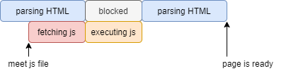
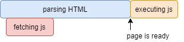
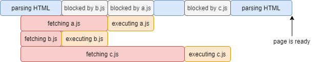
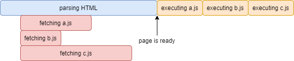

# JAVASCRIPT "studied by 드림코딩"</br>javascript part 1

## 1. javascript와 html

javascript 와 html 파일을 연결하여 프론트엔드 작업을 할 때 소스의 구성에 따라 페이지의 로드 속도가 다를 수 있다. 밑에서 여러 종류의 js와 html 파일의 연결을 알아보고 어떻게 사용하는 게 효율적인지 알아보자.

### 1. head 에 js 파일 링크(src)

```html
<!DOCTYPE html>
<html>
    <head>
        <meta charset="utf-8">
        <title>Document</title>
        <script src="main.js"></script>
    </head>
    <body></body>
</html>
```


* **기능**</br>
위의 방식은 제일 기본적인 js 파일을 로드하는 방식이다. html 파일을 리딩하는 도중 js 파일을 만나면 js 파일을 먼저 리딩하고 실행하는데 이 js 파일을 다루는 시간에 html 파일리딩은 멈추게 된다.
* **장점**</br>
가장 기본적인 js 파일을 가져오는 방식이다
* **단점** </br>
위의 방식으로 실행 될 때 만약 js 파일의 덩치가 엄청나게 크다면 페이지를 로드할 때 js 파일을 로드하는 시간동안은 페이지 로드가 막히게 된다. 이 block 이 되는 시간이 길어지면 길어질수록 사용자는 불편해 진다.

### 2. body 에 js 파일 링크(src)

```html
<!DOCTYPE html>
<html>
    <head>
        <meta charset="utf-8">
        <title>Document</title>
    </head>
    <body>
      <script src="main.js"></script>
    </body>
</html>
```


* **기능**</br>
위의 방식은 html 의 모든 소스를 리딩한 후 페이지가 준비된 상태에서 js 파일을 리딩하고 실행한다.
* **장점**</br>
위의 방식으로 사용할 때 js 파일을 다루기 전에 이미 페이지의 로드를 마쳐놓았기 때문에 js 파일의 크기가 크더라도 사용자 입장에서는 이미 로드가 끝나게 되었기 때문에 불편이 줄어든다.
* **단점**</br>
사용자가 html의 기본적인 컨텐츠를 빨리 볼 수 있지만 전체 프로그램에서 js 에 의한 애니메이션 컨트롤, 서버에서 js 파일이 많은 것 등 프로그램이 js 에 대한 의존도가 높다면 프로그램 전체의 로드 속도가 느려진다.

### 3. head 에 js 파일 링크(async src)

```html
<!DOCTYPE html>
<html>
    <head>
        <meta charset="utf-8">
        <title>Document</title>
        <script async src="main.js"></script>
    </head>
    <body></body>
</html>
```




* **기능**</br>
위의 방식을 사용할 때 기본적으로 html 파일을 읽고 읽는 도중 js 파일을 만나면 병렬로 js 파일을 읽는다. 이후 html파일 중 js 가 속해 있는 소스까지 리딩이 끝나는 시점에 js 파일을 실행한다. 이후 html 파일을 마저 리딩한다.
* **장점**</br>
이렇게 한다면 fetching이 html 을 읽는 도중에 일어난다. 이렇게 되면 기존 src 방법에서 js파일을 리딩(fetching)할 때 멈춰 있는 것에 반해 위의 방식은 html을 읽을 수 있어서 전체 시간에 있어서 이득을 볼 수 있다.
* **단점**</br>
js 파일을 읽고 실행할 때 이후의 html 을 읽지 않았기 때문에 호이스팅 부분에서 문제가 생길 수 있다. 또한 js 파일의 실행시간동안 소스의 리딩이 멈추기 때문에 js 파일의 실행시간이 길다면 사용자가 기다리는 시간이 길어질 수 있다.

### 4. head 에 js 파일 링크(defer src)

```html
<!DOCTYPE html>
<html>
    <head>
        <meta charset="utf-8">
        <title>Document</title>
        <script defer src="main.js"></script>
    </head>
    <body></body>
</html>
```




* **기능**</br>
html 파일을 읽는 동안 js 파일을 리딩(fetching)한다. 이후 html 파일의 리딩이 끝났을 때 미리 리딩해 두었던 js 파일을 실행한다.
* **장점**</br>
이러한 방식이 js 파일이 많을 때 가장 효율적이며 가장 많이 쓰는 방법이다.
* **단점**</br>
대부분의 상황에서 이 defer 가 장점으로 작용한다. 단점이 없다고 볼 수는 없으나 크게 체감하지 못한다.


### 5. asnyc 와 defer 의 성능차이

asnyc와 defer 의 기능상의 차이를 알아보자

```html
<!DOCTYPE html>
<html>
    <head>
        <meta charset="utf-8">
        <title>Document</title>
        <script async src="a.js"></script>
        <script async src="b.js"></script>
        <script async src="c.js"></script>
    </head>
    <body></body>
</html>
```




* **asnyc의 문제점 1**<br>
위의 도표에서 볼 수 있듯 js 실행블록에서 다른 작업을 하지 못하여 시간낭비가 심하다.
* **asnyc의 문제점 2**<br>
만약 a.js 파일이 먼저 실행이 되어야 b.js 파일을 실행 할 수 있을 때 위의 도표에서 b.js 를 먼저 실행하였으므로 오류가 뜰 가능성이 높다.

```html
<!DOCTYPE html>
<html>
    <head>
        <meta charset="utf-8">
        <title>Document</title>
        <script defer src="a.js"></script>
        <script defer src="b.js"></script>
        <script defer src="c.js"></script>
    </head>
    <body></body>
</html>
```




위의 도표에서 알 수 있듯이 defer는 js 파일을 fetching할 때 순서대로 끝나지는 않지만 html 의 모든 소스를 리딩한 후 선언순서대로 하기 때문에 asnyc에서 나타난 문제가 나타나지 않는다.

## 2. 변수 variable

javascript 에서 변수는 다른 언어에 비해 큰 위상을 가진다. 기본적으로 자료형 없이 정의하여 사용하며 다른 언어와 달리 javascript의 변수는 수, 배열, 함수, 객체 등 javascript 가 가지고 있는 거의 모든 것을 담을 수 있다.

### 1. var 과 let

ECMA6 이전 javascript 에서는 변수로서 `var` 를 썼다. 하지만 `var` 는 호이스팅 문제로 인해 이상한 결과값을 도출하는 경우가 많다. 물론 호이스팅에 대해 완벽히 이해하고 있다면 이를 장점으로 사용할 수 있으나 프로그램의 덩치가 커지고 사용하는 변수가 많다면 일일히 이 모든것을 생각하며 코딩하는 것은 낭비이다. 밑의 소스를 참고하라

**[SOURCE]**
```javascript
name = 'jeahun'
console.log(name);

var name;
```

**[CONSOLE]**
```
jeahun
```

위의 소스에서 `name` 이라는 변수를 사용하기도 전에 대입과 출력을 했는데 정상적으로 작동한다. 이를 호이스팅 이라고 하며 호이스팅은 끌어올린다는 뜻인데 이는 javascript가 `var` 변수를 코드를 parsing 하는 과정에서 미리 읽기 때문에 가능한 일이다. 위에도 말했다 싶이 이러한 기능은 오류를 도출하기 쉬운 구조이다. 그렇다면 `let` 을 쓰면 어떻게 될까?

**[SOURCE]**
```javascript
name = 'jeahun'
console.log(name);

let name;
```

**[CONSOLE]**
```
ReferenceError: name is not defined
```

이러한 오류가 도출이 된다. `let` 은 다른 언어와 마찬가지로 동작하며 반드시 선언후에 사용을 해야 한다.

정리하면 ECMA6 이전 `var` 로 변수를 선언하면 호이스팅이라는 위험성이 존재한다. ECMA6 이후는 `let` 을 지원하므로 왠만하면 `let` 을 쓰는 것을 추천한다.

### 2. const

const 는 immutable type 즉 변경이 불가능한 변수타입이다. 이는 밑의 3가지 이유때문에 사용한다.
* **for security**</br>
해커들이 이 코드에 접근해도 변경이 불가능 하므로 보안상 이유로 사용
* **for thread safety**</br>
javascript 는 멀티스레드를 지원하므로 동시에 변경할 때 변경되지 말아야 할 정보들이 변경되는 위험을 방지할 수 있다.
* **for reduce human mistake**</br>
기본적으로 변경이 필요없는 경우에는 const 를 사용하는 것이 좋다.

### 3. 변수의 자료형 variable type
* **pritmitive** : number, string, boolean, null, undefined, symbol
* **object** : box-container
* **function** : first-class function

primitive varibale과 object variable 의 차이점은 아래 링크에 자세히 설명해 두었다.
[javascript생활코딩3](https://github.com/jeahun10717/javascriptStudy/blob/master/javascriptStudyBySHCD/javascriptBySHCD3.md#2-%EC%9B%90%EC%8B%9C-%EB%8D%B0%EC%9D%B4%ED%84%B0-%ED%83%80%EC%9E%85-primitive-type)

이제 javascript 의 변수와 다른 언어의 변수를 비교해보자.

**[SOURCE-C]**
```c
int main(){
  short a = 12;
  int b = 12;
  long b = 1234;
  float d = 1.2f;
  double e = 1.2f;
}
```

**[SOURCE-JAVA]**
```java
class Main{
    public static void main(String[ ] args){
      short a = 12;
      int b = 12;
      long b = 1234;
      float d = 1.2f;
      double e = 1.2f;
    }
}
```

**[SOURCE-JAVASCRIPT]**
```javascript
let a = 12;
let b = 1234;
let c = 1.225
```

위의 소스는 C , Java , JavaScript 의 자료형 들이다. C 나 Java 는 자료형이 세세하게 나누어져 있어서 코드 작성자가 이를 구분하고 사용해야 한다. 하지만 javascript 는 변수를 받을 때 알아서 해결을 해 주므로 let 하나만 기억하면 된다.

* javascript 의 자료형은 let 하나만 있지만 특별한 형태가 있다. 이는 기억해 두는 것이 좋다.

  * Infinity : 수를 0으로 나눌 때
  * -Infinity : -수를 0으로 나눌 때
  * NaN : 문자열과 다른 자료형을 나누거나 곱할 때

**[SOURCE]**

```javascript
const infinity = 1/0;
const negativeInfinity = -1/0;
const nAn = 'not a number' / 2;

console.log(infinity);
console.log(negativeInfinity);
console.log(nAn);
```

**[CONSOLE]**

```
Infinity
-Infinity
NaN
```

### 4. Dynamic Typing

javascript 는 dynamically tpyed language 라고 한다. 즉 변수가 특정하게 언어가 지정해 주는 것이 아니라 기본적으로 javascript가 1줄 1줄 해석할 때 마다 적용하는 것이다. 밑의 소스를 보자.

**[SOURCE]**

```javascript
let text = 'hello';
console.log(`value : ${text}, type : ${typeof text}`);
text = 1;
console.log(`value : ${text}, type : ${typeof text}`);
```

**[CONSOLE]**

```
value : hello, type : string
value : 1, type : number
```


위의 소스를 보면 분명 text는 hello 를 대입함으로써 string 으로 취급을 받았지만 후에 수를 입력하게 되면서 number로 타입이 바뀌게 되었다.

## 3. Operators

### 1. String Concatnation

위에서 알아보았듯 javascript 는 dynamic tpye을 지원하기 때문에 string 으로 사칙연산을 할 때 주의하여야 한다.

**[SOURCE]**

```javascript
let a = 'my'+' car'; //문자열 + 문자열 = 문자열
let b = 'try '+123;//문자열 + 숫자 = 문자열
let c = '123'/'3';//문자열(수)/문자열(수) = 숫자

console.log(a, typeof a);
console.log(b, typeof b);
console.log(c, typeof c);
```

**[CONSOLE]**

```
my car string
try 123 string
41 'number'
```

### 2. Numberic Operators

javascript의 수의 사칙연산은 기본적으로 다른 언어와 비슷하다.

**[SOURCE]**

```javascript
console.log(1+1);
console.log(1-1);
console.log(1*1);
console.log(1/1);
console.log(12%5);
console.log(5**2);
```

**[CONSOLE]**

```
2
0
1
1
2
25
```

### 3. Increment and Decrement Operators

1. **Increment Operators**

선행처리(Increment Operators)는 연산후 대입을 진행한다.

**[SOURCE]**

```javascript
let count = 2;
const preIncrement = ++count;
console.log(`preIncrement : ${preIncrement}`);
console.log(`count : ${count}`);
```

**[CONSOLE]**

```
3
```

2. **Decrement Operators**

후행처리(Decrement Operators)는 대입후 연산을 진행한다.

**[SOURCE]**

```javascript
let count = 2;
const postIncrement = count++;
console.log(`postIncrement : ${postIncrement}`);
console.log(`count : ${count}`);
```

**[CONSOLE]**

```
postIncrement : 2
count : 3
```

### 4. Logical Operators

javascript 에서의 논리연산자(Logical Operators)는 기본적인 언어와 동작구조가 비슷하다. 하지만 `||`(or) 를 사용할 때 제일 앞의 논리연산자가 `true` 면 뒤의 내용을 생략해 버린다. 또한 `&&`(and) 를 사용할 때 제일 앞의 논리연산자가 `false` 이면 뒤의 내용을 생략한다. 밑의 소스를 보자.

**[SOURCE]**

```javascript
const bool1 = true;
const bool2 = 4 < 2;

console.log(`or : ${bool1||bool2||check()}`);
console.log(`and : ${bool2&&bool1&&check()}`);

function check() {
    for (let i = 0; i < 10; i++) {
        console.log('OMG');
    }
}
```

**[CONSOLE]**

```
or : true
and : false
```

위의 소스에서 `check()` 라는 함수가 실행되지 않았다. 이는 `bool1` 이 이미 `true` 여서 뒤의 소스가 실행되지 않은 것이다. 그렇기 때문에 프로그램을 짤 때 논리연산자를 여러번 사용하여 제어할 경우 덩치가 큰 코드를 뒤에 배치하면 자원을 아낄 수 있다.

### 5. Equality

javascript 에서 equality 를 비교하는 연산자는 2개 이다. `==`과 `===`이 있는데 이에 대해 밑의 코드를 보면서 알아보자.

**[SOURCE]**

```javascript
const stringVar = '5';
const numberVar = 5;

// loose equality
console.log(stringVar == numberVar);
console.log(stringVar != numberVar);

// strict equality
console.log(stringVar === numberVar);
console.log(stringVar !== numberVar);
```

**[CONSOLE]**

```
true
false
false
true
```

## 3. 함수 function

javascript 에서의 함수는 다른 언어에 비해 그 위상이 높으며 상당히 중요하다. 주요한 함수의 기능과 함수 사용시 주의해야 할 사항들을 밑의 링크에 저장해 두었다.

[javascriptBySHCD2 - 2. 함수](https://github.com/jeahun10717/javascriptStudy/blob/master/javascriptStudyBySHCD/javascriptBySHCD2.md#2-%ED%95%A8%EC%88%98--function)

### 1. Parameters

#### 1. premitive parameters, object parameters

javascript 는 함수의 매개변수(parameters) 로 객체, 배열, 함수자체 등도 담을 수 있다. 밑의 소스는 함수의 매개변수로 객체를 받았을 경우이다.


**[SOURCE]**

```javascript
function changeName(obj) {
    obj.name='coder'
}
const jeahun = {name : 'jeahun'}
changeName(jeahun);
console.log(jeahun);
```

**[CONSOLE]**

```
{ name: 'coder' }
```

하지만 기본적으로 premitive parameters 와 object parameters 의 적용방식이 다르다. 이는 이 2개의 인자들을 접근할 때 방식의 차이에서 발생하는데 이 때 생기는 문제점들을 밑의 링크에 자세히 설명해 두었다. 간단히 요약하자면 premitive value 는 값 자체를 주고 받지만 object 는 주소(refernece) 를 주고받기 때문이다.

[javascriptBySHCD3 - 3. 복제](https://github.com/jeahun10717/javascriptStudy/blob/master/javascriptStudyBySHCD/javascriptBySHCD3.md#3-%EB%B3%B5%EC%A0%9C)

#### 2. Default Parameters

이 Default Parameter가 필요한 상황을 알아보자. 밑의 소스를 보라

**[SOURCE]**

```javascript
function showmessage(message, from) {
    if(from === undefined){
        from = 'unknown'
    }
    console.log(`${message} by ${from}`);
}

showmessage('Hi!')
```

**[CONSOLE]**

```
Hi! by unknown
```

위의 소스에서 showmessage 라는 함수의 매개변수로 message만 전달이 되고 from 이 전달되지 않았다. 이 때 ECMA6 이전에서는 위의 소스처럼 if 로 처리를 해서 따로 정의를 했어야 했다. 하지만 ECMA6 이후에는 변수로 받을 때 if 로 처리하지 않고 아래와 같은 문법을 사용할 수 있다.

**[SOURCE]**

```javascript
function showmessage(message, from='unknown') {
    console.log(`${message} by ${from}`);
}

showmessage('Hi!')
```

**[CONSOLE]**

```
Hi! by unknown
```
위의 소스와 같이 parameter를 전달해 주지 않을 때 위의 소스처럼 함수에서 미리 초기화를 해 놓으면 그 초기화 해 놓은 값을 도출한다. 또한 javascript 에서 함수가 받는 인자는 상당히 유연하게 작동한다. 이러한 특징은 javascript 만의 특징이며 다른 언어에서는 매개변수의 수를 상당히 엄밀하게 따지니 정확히 알고 쓰는 것이 좋다. 이러한 javscript 의 특징을 밑의 링크에 정리해 두었다.

[javascriptBySHCD2 - 2-4. 함수가 받는 인자의 개수](https://github.com/jeahun10717/javascriptStudy/blob/master/javascriptStudyBySHCD/javascriptBySHCD2.md#4-%ED%95%A8%EC%88%98%EA%B0%80-%EB%B0%9B%EB%8A%94-%EC%9D%B8%EC%9E%90%EC%9D%98-%EA%B0%9C%EC%88%98--arguments-%EA%B0%9D%EC%B2%B4)

#### 3. Rest Parameters

rest parameters 란 함수의 인자로 배열을 받는 매개변수이다. 밑의 소스를 보자.

**[SOURCE]**

```javascript
function printAll(...args) {
    for (let i = 0; i < args.length; i++) {
        console.log(args[i]);        
    }
}

printAll('dreams', 'coding', 'ellie');
```

**[CONSOLE]**

```
dreams
coding
ellie
```

`printAll('dreams', 'coding', 'ellie');` 부분에서처럼 함수에 여러 인자들을 전달해야 하고 그 개수를 정확히 파악하지 못하게 변하는 값이면 `...`(spread) 형태로 인자를 받을 수 있다.

### 2. Function Expression

#### 1. 함수선언식(Function Declaration)

함수선언식은 다른 언어와 구조가 비슷하다.

```javascript
function functionName(parameter) {
  함수코드
  return 리턴값;
}
```

이러한 함수선언식은 다른 언어와 유사하지만 javascript에서 이런식으로 함수를 선언하면 함수를 선언하기 전에 사용이 가능한 호이스팅이 지원이 된다. 밑의 소스를 참조하라.

**[SOURCE]**

```javascript
print();
function print () {  //anonymous function, 익명함수
    console.log('print');
}
```

**[CONSOLE]**

```
print
```

#### 2. 함수표현식(Function Expression)

함수표현식은 javascript 가 가지고 있는 특징으로 변수에 함수를 저장하여 그 변수를 마치 함수처럼 쓸 수 있도록 하는 기능이다. 밑의 소스를 보라.

**[SOURCE]**

```javascript
const print = function () {//anonymous function
    console.log('print');
}

print();
const printAgain = print;
printAgain();
```

**[CONSOLE]**

```
print
print
```

위의 소스에서 함수를 변수에 저장하고 또 대입한 그 변수를 다른 변수에 대입하여 함수를 사용하였다. 하지만 이러한 방식의 선언은 호이스팅을 지원하지 않는다. 밑의 소스를 보자.

**[SOURCE]**

```javascript
print();
const print = function () {//anonymous function
    console.log('print');
}
const printAgain = print;
printAgain();
```

**[CONSOLE]**

```
ReferenceError: print is not defined
```

print 가 정의 되지 않았다고 뜬다. 이것은 print 가 정의되기 전에 사용되었기 때문에 이러한 오류문구가 뜬 것이다.

#### 3. Arrow Function

Arrow Function 은 함수를 간결히 사용할 수 있는 js 만의 문법이다. 기본적인 사용법은 아래와 같다.

```javascript
const 변수 = (parameter) => 함수코드//리턴값
```

```javascript
const 변수 = (parameter) => {
  함수코드;
  return 리턴값;
}
```

일반적인 함수선언과 비교해 보자

**[SOURCE-function expression]**
```javascript
const sum = function(a, b){
    return a+b;
}
console.log(sum(65, 55));
```

**[SOURCE-function expression]**
```javascript
const sum = (a, b)=>a+b
console.log(sum(65, 55));
```

위의 2개의 소스는 완전히 같은 기능을 한다. 일반적인 함수에 비해 function 이라는 키워드를 적지 않아도 된다는 점, 1줄 안에 간단한 함수는 선언이 가능하다는 점에서 일반적인 함수 선언에 비해 javascript 에서는 arrow function 이 많이 쓰인다.

#### 4. IIFE(Immediatly Ivoked Function Expression)

IIFE(즉시실행 함수) 는 함수를 선언함과 동시에 사용하는 것을 의미한다.

```javascript
(function 함수이름(){
  함수코드;
})();
```

일회성으로 사용하는 함수에 한해 이러한 기능도 제공이 된다
