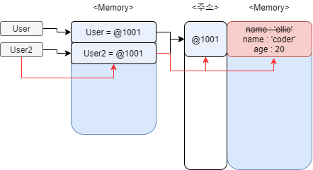

# JAVASCRIPT "studied by 드림코딩"</br>javascript part 2

## 3. Class

Class 란 Object를 담는 그릇이라고 생각하면 편하다. 객체 지향 프로그래밍에서 Object를 묶어 주는 역할을 하는 것이 Class 이다. javascript 에서는 기본적으로 Class 라는 것이 존재하지 않는다. 하지만 ESMA 6 이후 prototype 이라는 javascript 가 제공하는 기능으로 Class 인 것처럼 사용할 수 있게 만들었다. Class 라는 기능이 따로 존재하는 다른 언어와는 차이가 있다.

### 1. Class Declaration

**[SOURCE]**

```javascript
class Person{
    constructor(name, age){
        this.name=name;
        this.age=age;
    }
    speak(){
        console.log(`${this.name} : hello!`);
    }
}

const jeahun = new Person('jeahun', 24);
console.log(jeahun.name);
console.log(jeahun.age);
jeahun.speak();
```

**[CONSOLE]**

```
jeahun
24
jeahun : hello!
```

### 2. Getter & Setter

Get 과 Set 은 Class 를 사용할 떄 특정한 정보를 private 하게 지켜야 하거나 정보를 처리할 때 특정한 조건을 줘야할 때 사용한다.

**[SOURCE]**

```javascript
class User{
    constructor(firstName, lastName, age){
        this.firstName=firstName;
        this.lastName=lastName;
        this.age=age;
    }
    get age(){
        return this.age;
    }
    set age(value){
        if(value < 0){
          throw Error('age value is not allow negative number')
        }
        this.age=value;
    }
}


const user1 = new User('Jeahun', 'Sung', -1)
console.log(user1.age);
```

**[CONSOLE]**

```
RangeError: Maximum call stack size exceeded
    at User.set age [as age] (D:\javascript\javascriptStudy\javascriptStudyByDRCD\additionalCodeFiles\class.js:14:17)
    at User.set age [as age] (D:\javascript\javascriptStudy\javascriptStudyByDRCD\additionalCodeFiles\class.js:14:17)
    at User.set age [as age] (D:\javascript\javascriptStudy\javascriptStudyByDRCD\additionalCodeFiles\class.js:14:17)
    at User.set age [as age] (D:\javascript\javascriptStudy\javascriptStudyByDRCD\additionalCodeFiles\class.js:14:17)
    at User.set age [as age] (D:\javascript\javascriptStudy\javascriptStudyByDRCD\additionalCodeFiles\class.js:14:17)
    at User.set age [as age] (D:\javascript\javascriptStudy\javascriptStudyByDRCD\additionalCodeFiles\class.js:14:17)
    at User.set age [as age] (D:\javascript\javascriptStudy\javascriptStudyByDRCD\additionalCodeFiles\class.js:14:17)
    at User.set age [as age] (D:\javascript\javascriptStudy\javascriptStudyByDRCD\additionalCodeFiles\class.js:14:17)
    at User.set age [as age] (D:\javascript\javascriptStudy\javascriptStudyByDRCD\additionalCodeFiles\class.js:14:17)
    at User.set age [as age] (D:\javascript\javascriptStudy\javascriptStudyByDRCD\additionalCodeFiles\class.js:14:17)
```

우리가 원하는 동작은 `age` 라는 변수가 음수면 에러메시지를 띄우는 것이다. 하지만 위의 console 의 결과값을 보면 call stack 이 최대보다 넘어 섰다는 뜻의 오류문구가 나왔다. 이러한 오류는 get 과 set 의 동작구조에 의해 발생한다.

```javascript
constructor(firstName, lastName, age){
    this.firstName=firstName;
    this.lastName=lastName;
    this.age=age;
}
get age(){
    return this.age;
}
set age(value){
    if(value < 0){
        throw Error('age value is not allow negative number')
    }
    this.age=value;
}
```

이 부분에서 `get age`와 `set age`가 선언되는 순간 `this.age=age` 라는 라인의 동작구조가 달라진다. 원래의 동작구조는 메모리에 올라가 있는 `this.age` 를 가져와야 한다. 하지만 `get`과 `set`이 선언되는 순간 밑의 순서를 따라 동작한다.

1. `get` 이 선언 될 때 `this.age`는 메모리가 아닌 `get`을 먼저 호출한다.
2. `=age`, 즉 값을 할당할 때 역시 메모리에서 값을 가져오는 것이 아닌 `set`을 먼저 호출한다.
3. `set age()`가 호출 당했을 때 `this.age=value` 라는 코드가 실행된다.
4. `value`를 `this.age`에 할당할 때 위의 2. 의 과정과 마찬가지로 값을 할당하는 과정이므로 `set` 을 호출(set age() 를 호출)한다.
5. `set` 을 호출하면 다시 `this.age=value;` 코드를 실행한다.
6. **3.~5. 까지의 과정**을 **무한으로 반복**하게 되어서 callstack exceeded가 뜬 것이다.


이러한 문제는 this.age 라는 코드가 constructor 라는 클래스와 get age(), set age() 라고 하는 함수에서 구분 없이 쓰여서 그렇다. 이 문제는 get과 set 함수에서 쓰이는 변수를 다르게 해 줌으로써 해결이 가능하다.

**[SOURCE]**

```javascript
class User{
    constructor(firstName, lastName, age){
        this.firstName=firstName;
        this.lastName=lastName;
        this.age=age;
    }
    get age(){
        return this.age_private;
    }
    set age(value){
        if(value < 0){
            throw Error('age value is not allow negative number')
        }
        this.age_private=value;
    }
}


const user1 = new User('Jeahun', 'Sung', -1)
console.log(user1.age);
```

**[CONSOLE]**

```
Error: age value is not allow negative number
```

위의 소스에서 constructor가 쓰는 age라는 변수를 get과 set 에서 age_private 을 쓰므로서 명확히 구분을 줌으로써 해결을 했다.

### 3. Public & Private

java 나 cpp 같은 프로그래밍 언어에서 지원하는 Public, Private 개념을 javascript에서도 지원을 한다. 하지만 이러한 기능을 js 에서 지원한 것은 최근의 일이므로 많은 브라우저에서 지원을 하지 않으므로 호환성을 생각하면서 사용하여야 한다.

**[SOURCE]**

```javascript
class Experiment {
    publicField = 2;
    #privateField = 0;
}

const experiment = new Experiment();
console.log(experiment.publicField);
console.log(experiment.privateField);
```

**[CONSOLE]**

```
2
undefined
```

### 4. static

static 은 class 자체에 할당하는 프로퍼티나 메소드로서 클래스를 통해 객체를 만들었을 때 객체에서는 접근이 불가하고 class 를 통해서만 접근이 가능하다.

**[SOURCE]**

```javascript
class Article {
    static publisher = 'Dream Coding'
    constructor(articleNumber){
        this.articleNumber=articleNumber;
    }

    static printPublisher(){
        console.log(Article.publisher);
    }
}

const article1 = new Article(1);
const article2 = new Article(2);

console.log(article1.publisher);
console.log(Article.publisher);
```

**[CONSOLE]**

```
undefined
Dream Coding
```

위의 코드를 보면 `article1` 이라는 객체에서 `publisher` 를 호출하면 `undefined` 가 뜨는 것을 확인 할 수 있다. 이는 `publisher` 가 class 에만 소속되어 있기 때문인데 `publisher` 에 접근하려면 클래스 자체에 접근하여 사용하면 된다. 즉 `Article.publisher` 로 출력을 하면 정상적으로 동작한다. 이러한 static은 class 내에서 Object 와 상관없이 사용되는 메소드나 프로퍼티를 정의하고 사용할 때 사용한다.

### 5. inheritance of Class

어떠한 기능을 만들 때 반복적으로 사용되는 기능이 존재할 수 있다. 이러한 기능들을 class 로 만들어 놓고 그 기능들을 상속시켜 다른 class 를 만들어서 사용한다면 유지보수가 쉽고, 소스타이핑 하는 시간을 줄일 수 있다. </br>
밑에서는 어떠한 도형들의 넓이와 그 색을 알아내는 코드를 만든다고 생각해 보자.

**[SOURCE]**

```javascript
class Shape {
    constructor(width, height, color){
        this.width = width;
        this.height = height;
        this.color = color;
    }

    draw(){
        console.log(`drawing ${this.color} color of`);
    }
    getArea(){
        return this.width * this.height
    }
}

class Rectangle extends Shape {}
class Triangle extends Shape {}

const rectangle = new Rectangle(20, 20, 'blue');
rectangle.draw();
const triangle = new Triangle(20, 20, 'red');
tirangle.draw();
```

**[CONSOLE]**

```
drawing blue color of
drawing red color of
```

위의 소스처럼 extends 를 통해 Shpae 이라는 class 를 rectangle, triangle 에 상속시키면 Shape이라는 코드를 2번이나 줄일 수 있다. 이러한 기능 외에도 만약 `drawing red(blue) color of` 를 `drawing red(blue) color!` 로 수정하고 싶으면 Shape의 draw() 메소드만 수정하면 모두 바뀌게 된다. 이러한 것이 상속의 장점이다. 밑의 소스를 참고하라

**[SOURCE]**

```javascript
class Shape {
    constructor(width, height, color){
        this.width = width;
        this.height = height;
        this.color = color;
    }

    draw(){
        console.log(`drawing ${this.color} color!`);
    }
    getArea(){
        return this.width * this.height
    }
}

class Rectangle extends Shape {}
class Triangle extends Shape {}

const rectangle = new Rectangle(20, 20, 'blue');
rectangle.draw();
const triangle = new Triangle(20, 20, 'red');
tirangle.draw();
```

**[CONSOLE]**

```
drawing blue color!
drawing red color!
```

또한 위의 소스에서 직사각형과 삼각형의 넓이를 구하는 공식이 다르다. 이러한 부분 또한 상속을 사용할 때의 다양성을 통해 수정이 가능하다.

**[SOURCE]**

```javascript
class Shape {
    constructor(width, height, color){
        this.width = width;
        this.height = height;
        this.color = color;
    }

    draw(){
        console.log(`drawing ${this.color} color of`);
    }
    getArea(){
        return this.width * this.height
    }
}

class Rectangle extends Shape {}
class Triangle extends Shape {
    getArea(){
        return(this.width * this.height) / 2;
    }
}

const rectangle = new Rectangle(20, 20, 'blue');
rectangle.draw();
console.log(rectangle.getArea());

const triangle = new Triangle(20, 20, 'red');
triangle.draw();
console.log(triangle.getArea());
```

**[CONSOLE]**

```
drawing blue color of
400
drawing red color of
200
```

위의 소스에서 `class Triagle extends Shape` 부분만 보자

```javascript
class Triangle extends Shape {
  getArea(){
    return (this.width * this.height) / 2;
  }
}
```

원래의 `getArea()` 메소드는 `this.width*this.height` 였는데 `class Triangle` 에서 `(this.width * this.height) / 2` 로 수정하여 사용할 수 있도록 하였다. 이러한 기능을 **Overriding** 이라고 하며 원래의 기능 외에 기능을 추가하거나 기능을 변경할 때 사용한다. 단 주의할 것은 이러한 overriding 을 사용하면 원래의 기능을 상실한다. overriding을 하되 원래의 기능도 유지해야 할 때 `super` 를 사용한다. 아래를 참고하라.

**[SOURCE]**

```javascript
class Shape {
    constructor(width, height, color){
        this.width = width;
        this.height = height;
        this.color = color;
    }

    draw(){
        console.log(`drawing ${this.color} color of`);
    }
    getArea(){
        return this.width * this.height
    }
}

class Rectangle extends Shape {}
class Triangle extends Shape {
    draw(){
        console.log('△');
    }
    getArea(){
        return(this.width * this.height) / 2;
    }
}

const rectangle = new Rectangle(20, 20, 'blue');
rectangle.draw();
console.log(rectangle.getArea());

const triangle = new Triangle(20, 20, 'red');
triangle.draw();
console.log(triangle.getArea());
```

**[CONSOLE]**

```
drawing blue color of
400
△
200
```

위의 `class Triangle` 안에서 `draw()` 로 overrinding 을 했다. 이 때 `drawing red color of` 가 출력되지 않는다. 만약 `drawing red color of` 를 출력하고 싶으면 아래의 코드를 `class Trigangle` 부분에 삽입하면 된다.

```javascript
class Triangle extends Shape {
    draw(){
        super.draw();
        console.log('△');
    }
    getArea(){
        return(this.width * this.height) / 2;
    }
}
```

super 는 부모 클래스의 메소드를 자식 클래스의 overriding과는 상관없이 가져와서 사용할 수 있도록 해 준다.

### 6. instanceof(class checking)

instanceof 는 상속관계를 boolean type 으로 도출해 주는 메소드이다. 기본적인 사용법은 아래와 같다.

```javascript
자식객체 instanceof 부모객체//type === boolean
```

우리가 위에서 썼던 소스를 통해 자세히 알아보자.

**[SOURCE]**

```javascript
class Shape {
    constructor(width, height, color){
        this.width = width;
        this.height = height;
        this.color = color;
    }

    draw(){
        console.log(`drawing ${this.color} color of`);
    }
    getArea(){
        return this.width * this.height
    }
}

class Rectangle extends Shape {}
class Triangle extends Shape {
    draw(){
        console.log('△');
    }
    getArea(){
        return(this.width * this.height) / 2;
    }
}

const rectangle = new Rectangle(20, 20, 'blue');
rectangle.draw();
console.log(rectangle.getArea());

const triangle = new Triangle(20, 20, 'red');
triangle.draw();
console.log(triangle.getArea());

console.log('-----------check of instance----------');
console.log(rectangle instanceof Rectangle);
console.log(triangle instanceof Rectangle);
console.log(triangle instanceof Triangle);
console.log(triangle instanceof Shape);
console.log(triangle instanceof Object);
```

**[CONSOLE]**

```
drawing blue color of
400
△
200
-----------check of instance----------
true
false
true
true
true
```

다른 부분은 위의 소스를 보면서 차근차근 보면 이해할 수 있다. `triangle instanceof Object` 에서 `Object`는 모든 javascript 위에 존재하는 객체이다. 앞에서도 알아보았지만 javascript는 class라는 형태가 존재하는 것이 아니라 객체를 통해 class 의 개념을 만든 것이기 때문에 클래스도 객체로 본다.

## 4. Object

### 1. Literals and Properties

Object는 key 와 value 로 이루어진 데이터의 집합체이다. 기본적인 사용법은 아래와 같다.
* **1. object literal syntax**
```javascript
const objName = {key : value};
```
* **2. object constructor syntax**
```javascript
const objName = new Object();
```

const 라는 데이터 타입을 객체에서 사용할 때 문제점이 생길 수 있다. 기존의 premitive variable 에서는 const 로 선언한 데이터는 수정이나 삭제가 불가능 했는데 객체는 그렇지 않다.

**[SOURCE]**

```javascript
const person = {
    'name' : 'jeahun',
    'age' : 24,
}
console.log(person);
person.gender = 'male'
console.log(person);
delete person.age
console.log(person);
```

**[CONSOLE]**

```
{ name: 'jeahun', age: 24 }
{ name: 'jeahun', age: 24, gender: 'male' }
{ name: 'jeahun', gender: 'male' }
```

위의 소스에서도 볼 수 있듯이 `person` 이라는 객체를 `const` 로 선언했음에도 `gender` 라는 프로퍼티를 추가 했고 `age` 라는 프로퍼티를 제거 했다. 이는 객체가 premitive variable과는 달리 참조 주소를 가지고 있어서 그렇다. 또한 javascript에서 배열, 함수, 클래스 모두 객체로 취급하므로 const 로 선언하더라도 수정이나 추가 삭제가 가능하다.

### 2. Computed Properties

생성된 객체를 호출하는 방법에는 크게 2가지가 있다.
* **1. use `.`**
```javascript
objName.keyName;
```
* **2. use `[]`** (computed property)
```javascript
objName['keyName']
```

**[SOURCE]**

```javascript
const person = {
    'name' : 'jeahun',
    'age' : 24,
}
person.gender = 'male';
test='gender'

console.log(person.gender);
console.log(person['gender']);
```

**[CONSOLE]**

```
male
male
```

위의 2가지의 호출은 동작은 같다. 하지만 쓰는 방식에서 차이가 있다. `.`의 호출은 대부분의 상황에서 쓰는데 만약에 key값이 정해져 있지 않다면 쓸 수가 없다. 받아올 key 값에 따라 달라지게 만들려면 `[]`를 쓰는 것이 좋다. 밑의 소스를 보자

**[SOURCE]**

```javascript
const person = {
    'name' : 'jeahun',
    'age' : 24,
}
person.gender = 'male';

function printValue(obj, key) {//(객체, key 이름)
    console.log(obj.key);
}
function printValueOfCP(obj, key) {
    console.log(obj[key]);
}
printValue(person, 'name')
printValueOfCP(person, 'name')
```

**[CONSOLE]**

```
undefined
jeahun
```

위의 코드에서 `obj`와 `key` 라는 매개변수를 이용해 객체의 프로퍼티값을 가져오는 함수를 2개 만들었다. 이 때 `printValue` 함수는 `.`를 사용하여 출력값을 요청했지만 `undefined`가 떴고, `printValueOfCP` 함수는 `[]` 를 사용하여 출력값을 요청했고 정상적으로 `jeahun`을 출력했다. 이러한 특징 때문에 만약 key 값이 동적이고 수정이나 추가 같은 작업을 해야 할 때 즉 변하는 값일 때는 `[]`(computed property) 를 사용하는 것이 좋다.

### 4. Property value Shorthand

**[SOURCE]**
```javascript
const person1 = {name : 'bob', age : 12};
const person2 = {name : 'anne', age : 33};
const person3 = {name : 'jeahun', age : 24};
```

위의 소스에서 매번 같은 포맷의 객체를 선언하는데 매번 같은 소스를 반복해서 써야 한다. 이를 함수를 통해 해결해 보자. 밑의 소스를 보라.

**[SOURCE]**
```javascript
function makePerson(name, age) {
    return {
        name : name,
        age : age
    }
}
const person1 = makePerson('bob', 12)
const person2 = makePerson('anne', 33)
const person3 = makePerson('jeahun', 24)
const person4 = makePerson('steve', 3);
```

이런 식으로 함수를 작성하면 코드를 좀 더 적게 쓸 수 있다. 또한 위의 소스처럼 `name : name`, `age : age` 처럼 객체의 키값과 프로퍼티 값이 같을 때 축약해서 `name`, `age`만 사용할 수 있다. 이를 **Property value shorthand** 라고 한다. 밑의 소스를 참고하라.

**[SOURCE]**
```javascript
function makePerson(name, age) {
    return {
        name,
        age
    }
}
const person1 = makePerson('bob', 12)
const person2 = makePerson('anne', 33)
const person3 = makePerson('jeahun', 24)
const person4 = makePerson('steve', 3);
```

### 5. Constructor Function

**[SOURCE]**
```javascript
function makePerson(name, age) {
    return {
        name,
        age
    }
}
const person1 = makePerson('bob', 12)
const person2 = makePerson('anne', 33)
const person3 = makePerson('jeahun', 24)
const person4 = makePerson('steve', 3);
```

이 소스에서 `makePerson` 이라고 하는 함수는 `personN` 이라고 하는 객체를 생성하는 함수의 플랫폼처럼 쓰였다. 이러한 기능을 우리는 [3. Class](https://github.com/jeahun10717/javascriptStudy/blob/master/javascriptStudyByDRCD/javascriptByDRCD2.md#3-class) 에서 살펴보았다. 이러한 기능은 javascript가 공식적으로 class 를 지원하기 전 class 처럼 쓰기 위해 사용하였다. 이렇게 다른 기능이 없고 순수하게 객체를 생성하는 함수는 기본적으로 함수이름 제일앞을 대문자로 작성하며 `return` 이라는 값을 적지 않고 사용한다. 밑의 소스를 보자.

**[SOURCE]**
```javascript
function Person(name, age) {
    //this = {}
    this.name=name;
    this.age=age;
    //return this
}
const person1 = new Person('bob', 12)
const person2 = new Person('anne', 33)
const person3 = new Person('jeahun', 24)
const person4 = new Person('steve', 3);
```

위의 소스에서처럼 **객체를 생성하는 목적으로 사용하는 함수**를 **constructor function(생성자함수)** 라고 하며 위에서 볼 수 있듯이 빈 객체를 생성(`this={}`)하고 그 객체를 return하는 부분(`return this`)을 생략해서 사용한다.

### 6. in Operator

`in` 식별자는 타겟 객체에 해당 키가 존재하는지를 확인하는 기능이다. 기본적인 사용법은 아래와 같다.

```javscript
'key' in obj
```
`key` 값이 `obj` 안에 존재하면 `true`, 존재하지 않으면 `false` 를 리턴한다.

**[SOURCE]**
```javascript
function makePerson(name, age, gender, local) {
    return {
        name,
        age,
        gender,
        local
    }
}

const jeahun = new makePerson('jeahun', 24, 'man', 'Busan');

console.log('name' in jeahun);
console.log('local' in jeahun);
console.log('email' in jeahun);
```

**[CONSOLE]**
```
true
true
false
```

### for in & for of

`for in` 과 `for of` 는 기본적으로 반복문의 구조를 따른다.
* `for of` : 객체를 위한 반복문
* `for in` : 배열을 위한 반복문

**[SOURCE]**
```javascript
const personObj = {
    name : 'jeahun',
    age : 24,
    gender : 'male',
    local : 'Busan'
}
const personArr=[1, 2, 3, 4, 335]

for(key in personObj){
    console.log(key);
}

for(value of personArr){
    console.log(value);
}
```

**[CONSOLE]**
```
name
age
gender
local
1
2
3
4
335
```

위의 소스에서 `for in` 안의 `key`, `for of` 안의 `value` 는 아무 각각 객체에서 받아올 키값, 배열에서 받아올 값이다.

### 7. clone

javascript에서 객체를 그대로 복사해서 사용하고 싶을 때 어떻게 하면 될까? 기존의 다른 문법과 같이 사용한다면 아래와 같은 문제가 발생한다.

**[SOURCE]**
```javascript
const user = {name : 'ellie', age : 20}
const user2 = user;
user2.name = 'coder';
console.log(user);
```

**[CONSOLE]**
```
{ name: 'coder', age: 20 }
```

위의 소스에서 `user2`의 `name`을 수정했으니 우리가 예상하기로 `user`의 `name` 은 그대로 `ellie` 일 것 같다. 하지만 실행을 시켜보면 `user`의 `name` 이 `coder` 로 바뀌어 있다. 이는 mutable datatype 은 그 데이터 자체를 저장하는 것이 아니라 참조주소를 저장하고 있기 떄문이다. 밑의 그림을 보자</br>
**<`user2.name = 'coder'` 부분 실행 전>**


위의 그림에서 user 는 `@1001` 이라는 주소를 가지고 있다고 가정해보자. 이 때 `user2 = user` 부분을 실행하게 되면 `user2` 에 `user`가 가지고 있는 객체 자체가 아닌 참조주소를 넘겨주게 된다. 즉 `user2` 역시 `@1001` 이라는 주소를 가지게 된다. 이 때 `user2.name = 'coder'` 부분을 실행하면 아래와 같은 도식을 나타낸다.

**<`user2.name = 'coder'` 부분 실행 후>**


위의 그림과 같이 `user2.name = 'coder'` 부분이 실행되면 `@1001` 이라는 참조주소를 따라 메모리에 접근하여 `name` 에 `coder`를 삽입하게 된다. 이 때 `user.name` 을 호출하면 `user`가 가지고 있는 `@1001` 의 주소로 가서 그 정보를 가져오는데 이 때 `@1001` 주소의 `name` 은 `coder` 이다. 우리는 `user2`의 `name`을 수정했지만 사실 `user`의 `name`도 수정된 것 같아 보인다. 하지만 이러한 변화는 mutable datatype의 동작구조를 보면 이해를 할 수 있다.</br>

그렇다면 javascript에서 복제는 어떻게 해야 할까? 아래의 2가지 방법이 존재한다.

1. **old way**
기본적인 대입연산자로는 복제시 위의 문제가 발생할 수 있으므로 빈 객체를 선언한 후 key와 property를 각각 일일히 대입하는 방법이 있다. 아래의 소스를 보자.

**[SOURCE]**
```javascript
const user = {name : 'ellie', age : 20}
const user2 = user;
console.log(user);

const user3 = {};
for(key in user){
    user3[key] = user[key];
}
user3.name='jeahun';

console.log(user3);
```

**[CONSOLE]**
```
{ name: 'ellie', age: 20 }
{ name: 'ellie', age: 20 }
```

위의 복제에서의 문제가 있는 소스와는 달리 user3.name = 'jeahun' 을 실행해도 user3의 객체의 name 만 변경이 된다. 하지만 이런 방법보다 쉬운 방법이 있다.

2. **`Object.assign`**

**[SOURCE]**
```javascript
const user = {name : 'ellie', age : 20}
const user2 = user;
console.log(user);

const user3 = {};
Object.assign(user3, user)

user3.name='jeahun'

console.log(user3);
```

**[CONSOLE]**
```
{ name: 'ellie', age: 20 }
{ name: 'ellie', age: 20 }
```

`assign` 메소드는 `Object` 표준내장객체 에 속한 메소드로 타겟 객체를 복사할 때 사용한다. 사용법은 아래의 링크에 들어가서 알아보면 된다.</br>

[`Object.assign()` javascript MDN](https://developer.mozilla.org/ko/docs/Web/JavaScript/Reference/Global_Objects/Object/assign)
