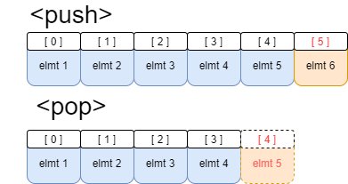
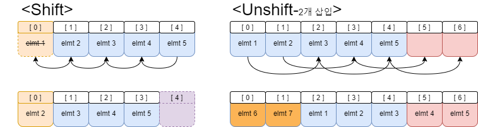
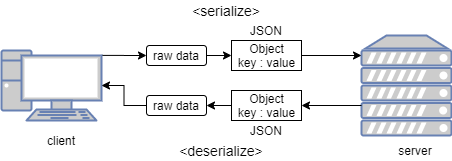

# JAVASCRIPT "studied by 드림코딩"</br>javascript part 3

## 4. 배열 _ Array

배열은 데이터들을 순차적으로 저장하는 것을 맗한다. 배열을 선언하고 할당할 때 다른 언어(cpp, java등)는 타입이 고정 되어 있어서 배열 안의 모든 값들은 같은 타입을 가지지만 javascript는 배열 안에서 다른 타입을 가질 수 있다.

### 1. 배열의 선언 _ Declaration

javascript에서 배열의 선언은 크게 2가지로 나뉜다.

* 1. 표준내장객체 Array 사용
* 2. 기본적은 배열선언

**[SOURCE]**
```javascript
const arr1 = new Array(1,5);
const arr2 = [1,2];

console.log(`type : ${typeof arr1}, arr1 : ${arr1}`);
console.log(`type : ${typeof arr2}, arr1 : ${arr2}`);
```

**[CONSOLE]**
```
type : object, arr1 : 1,5
type : object, arr1 : 1,2
```

### 2. 배열의 접근 _ Index position

배열의 **index** 는 **0부터 시작**하며 순차적으로 증가한다.

**[SOURCE]**
```javascript
const arr = ['apple', 'banana', 'melon', 'pear']

console.log(arr);
console.log(arr[0]);//배열의 첫번째 값
console.log(arr[arr.length-1]);//배열의 마지막
```

**[CONSOLE]**
```

```

### 3. 배열의 순회 _ Looping over an array

배열을 순회하며 모든 배열의 요소를 출력하는 방식은 크게 3가지가 있다.

* 1. for 문
* 2. for of 문
* 3. forEach 문

**[SOURCE]**
```javascript
const arr = ['apple', 'banana', 'melon', 'pear']

for (let i = 0; i < arr.length; i++) {
    console.log(arr[i]);
}
console.log('--------------------');

for (let arridx of arr) {
    console.log(arridx);
}
console.log('--------------------');

arr.forEach((arr) => console.log(arr));
console.log('--------------------');
```

**[CONSOLE]**
```
apple
banana
melon
pear
--------------------
apple
banana
melon
pear
--------------------
apple
banana
melon
pear
--------------------
```

### 4. 배열의 추가, 삭제 _ Addition, Deletion

* 1. **pop** : 배열의 마지막 삭제
* 2. **push** : 배열의 마지막에 추가
* 3. **unshift** : 배열의 시작부분에 추0(다수 가능)
* 4. **shift** : 배열의 첫번째 삭제

**[SOURCE]**
```javascript
const fruit = ['apple', 'banana', 'melon']

fruit.pop();
console.log(fruit);

fruit.push('tomato')
console.log(fruit);

fruit.unshift('mango', 'grape')
console.log(fruit);

fruit.shift();
console.log(fruit);
```

**[CONSOLE]**
```
[ 'apple', 'banana' ]
[ 'apple', 'banana', 'tomato' ]
[ 'mango', 'grape', 'apple', 'banana', 'tomato' ]
[ 'grape', 'apple', 'banana', 'tomato' ]
```

**주의**
`shift` 와 `unshift` 는 `pop` 과 `push` 에 비해 연산속도가 상당히 느리다. 이는 배열에 대해 조금만 생각해 보면 그 답이 나온다. 우선 `pop` 과 `push` 를 도식화 하면 아래와 같다.



`pop` 과 `push` 는 각각 배열에서 제일 끝 부분만 인덱스와 데이터를 삭제, 배열의 제일 끝 부분에서 추가만 하면 된다. 하지만 `shift`와 `unshift` 는 동작구조가 조금 다르다.



위의 그림을 보면 `shift` 는 일단 모든 배열의 요소를 1칸씩 댕겨서 대입시킨다. 그 후 제일 마지막 인덱스와 값이 비어있는데 그 부분을 삭제하는 것이다. `unshift` 역시 처음에 빈 인덱스를 2개 추가한다. 그 후 앞에서부터 2칸씩 밀어서 뒤로 대입한다. 그렇게 되면 처음 2칸이 비는데 그곳에 우리가 대입하고자 하는 값 2개를 넣는 것이다. 이러한 특징 때문에 배열이 크면 클수록 이러한 낭비가 심해진다. 따라서 shift와 unshift는 반드시 사용해야 할 때만 사용하자.

### 5. splice

splice 는 배열에서 일정부분을 지우고 그 부분에 삽입할 수 있는 메소드 이다.

**[how to use]**

```javascript
array.splice(startIndex, endIndex, insertElmt1, insertElmt2 .....)
```

**[SOURCE]**

```javascript
const fruits = ['apple', 'banana', 'melon', 'mango', 'pear'];
console.log(fruits);

fruits.splice(1, 3, '**', '**2');
console.log(fruits);
```

**[CONSOLE]**

```
[ 'apple', 'banana', 'melon', 'mango', 'pear' ]
[ 'apple', '**', '**2', 'pear' ]
```

### 6. searching

* **includes** : 해당 element 가 배열에 존재하는지를 true, false 로 return
* **indexOf** : 해당 element 가 존재하는 배열의 index를 return(존재하지 않으면 -1)

**[SOURCE]**

```javascript
const fruits = ['apple', 'banana', 'melon', 'mango', 'pear'];

console.log(fruits.includes('apple'));
console.log(fruits.includes('carrot'));
console.log(fruits.includes('pear'));
console.log(fruits.indexOf('carrot'));
```

**[CONSOLE]**

```
true
false
true
-1
```

## 5. JSON _ javascript 서버통신
JSON(Javascript Object Notation) 은 기존의 XML 을 이용한 통신의 불편함을 해소하고자 나온 포맷이다. 기존의 XML 은 지나치게 많은 태그로 인해 가독성이 떨어지고 서버에 전송하고자 하는 텍스트의 양이 과도하게 많아지는 문제점이 발생했다. 이러한 문제점을 JSON 은 서버에 전달하는 방식을 javascript의 Object 포맷을 따르는 것으로 해결했다. 이러한 JSON 은 기본적으로 서버에 데이터를 전달할 때 **js Object** 의 **key-value pair** 를 사용한다.
* client to server
클라이언트가 object 형태로 만들어서 `JSON.stringify` 라는 메소드를 사용하여 JSON 을 만든다. 이렇게 만들어진 JSON 을 서버에 전달한다. 이렇게 **js의 object**를 **JSON 으로 만드는 것**을 **serialize** 라고 한다.
* server to client
서버에서 JSON 을 받아오고 그 JSON 을 `JSON.parse` 라는 메소드를 사용하여 js 의 object로 변환한다. 이렇게 변환된 정보를 js 에서 사용한다. 이렇게 **JSON** 을 **js의 object로 만드는 것**을 **deserialize** 라고 한다.



### 1. Object to JSON

js 에서 boolean과 문자열을 JSON으로 넘겨보자

**[SOURCE]**
```javascript
let json = JSON.stringify(true);
console.log(json);

json = JSON.stringify(['apple', 'banana']);
console.log(json);
```

**[CONSOLE]**
```
true
["apple","banana"]
```

JSON 에서 문자열은 무조건 double quotation(`"`) 으로 처리한다. </br>
대부분의 js 의 object 는 전달이 가능하다. 하지만 일부 js 의 자료형이 전달이 불가하다.

**[SOURCE]**
```javascript
const dog = {
    name : 'mandu',
    color : 'white',
    size : null,
    birthDate : new Date(),
    jump : ()=> {
        console.log(`${name} can jump`);
    },
    Symbol: Symbol('id')
}

json = JSON.stringify(dog);
console.log(json);
```

**[CONSOLE]**
```
{"name":"mandu","color":"white","size":null,"birthDate":"2020-10-06T05:34:49.417Z"}
```

위의 소스에서 볼 수 있듯 `Symbol : Symbol('id')` 부분은 전달이 되지 않았다. 또한 jump 라는 함수역시 포함이 되지 않았다. JSON은 js의 문법과 유사하나 다소 차이가 있을 수 있으므로 자료형을 신경을 써야 한다.</br>

또한 JSON 에서 Object를 전달할 때 일부 프로퍼티만 전달이 가능하다. 위의 소스에서 아래 소스를 추가해서 실행해 보자.

**[SOURCE]**
```javascript
json = JSON.stringify(dog, ['name', 'color'])
console.log(json);
```
**[CONSOLE]**
```
{"name":"mandu","color":"white"}
```

위의 소스와 같이 일부 프로퍼티만 전달을 했다.

정리하면

* 배열이나 boolean 도 전달이 가능하다.
* javascript 에서 JSON 형태로 변환할 때 함수, Symbol 등은 전달이 되지 않는다.
* JSON 으로 변환할 때 일부만 전달이 가능하다.

### 2. JSON to Object

JSON 을 js 의 object로 변환할 때는 stringify.parse 를 사용한다. 여기서 주의해야 할 점이 몇가지 있다. 밑의 소스를 살펴보자

**[SOURCE]**
```javascript
const dog = {
    name : 'mandu',
    color : 'white',
    size : null,
    birthDate : new Date(),
    jump : ()=> {
        console.log(`${name} can jump`);
    },
    Symbol: Symbol('id')
}

json = JSON.stringify(dog);
const obj = JSON.parse(json);
console.log(obj);
```

**[CONSOLE]**
```
{
  name: 'mandu',
  color: 'white',
  size: null,
  birthDate: '2020-10-07T04:57:26.745Z'
}
```

  위의 소스는 `dog` 라는 object 를 생성하고 `json` 이라는 변수에 `dog` 라는 객체를 JSON 형태로 저장했다. 그 후 `obj` 라는 변수에 `json` 이라는 JSON 형태의 객체를 다시 원래의 객체로 돌려놓았다. 이 때 조심해야 할 것이 있다. 밑의 소스를 보자

**[SOURCE]**
```javascript
const dog = {
    name : 'mandu',
    color : 'white',
    size : null,
    birthDate : new Date(),
    jump : ()=> {
        console.log(`${name} can jump`);
    },
    Symbol: Symbol('id')
}

json = JSON.stringify(dog);
const obj = JSON.parse(json);
console.log(dog.birthDate.getDate());
```

**[CONSOLE]**
```
[Function: getDate]
undefined
```

위의 소스에서 `dog` 객체안의 `birthDate` 이라는 객체가 존재하는데 이는 `Date` 라는 표준내장객체를 저장하는 객체이다. 그렇기 때문에 `dog.birthDate.getDate()` 라는 메소드를 실행하면 해당 `day` 를 return 한다. 하지만 `console.log(obj.birthDate.getDate());` 를 실행하면 어떻게 될까?

**[SOURCE]**
```javascript
//위와 같은 소스
console.log(obj.birthDate.getDate());
```

**[CONSOLE]**
```
TypeError: obj.birthDate.getDate is not a function
```

위의 결과값과 같이 오류가 뜬다. 이러한 점은 JSON 의 특징 때문에 발생하는데 JSON 은 기본적으로 key-value 를 쌍으로 가지는 정보들을 저장하는데 이 때 이 **value 에 해당하는 값들은 문자열로 저장이 된다.** 이는 밑의 소스를 보면 자명하다.

**[SOURCE]**
```javascript
const dog = {
    name : 'mandu',
    color : 'white',
    size : null,
    birthDate : new Date(),
    jump : ()=> {
        console.log(`${name} can jump`);
    },
    Symbol: Symbol('id')
}

json = JSON.stringify(dog);
const obj = JSON.parse(json);

console.log(typeof dog.birthDate);
console.log(typeof obj.birthDate);
```


**[CONSOLE]**
```
object
string
```

`dog` 의 `birthDate` 의 타입은 object 인 것에 반해 `obj` 의 `birthDate` 의 타입은 string 이다. 그렇다면 Date() 객체를 다시 쓰려면 어떻게 해야 할까? 아래 소스를 참고하라

**[SOURCE]**
```javascript
const dog = {
    name : 'mandu',
    color : 'white',
    size : null,
    birthDate : new Date(),
    jump : ()=> {
        console.log(`${name} can jump`);
    },
    Symbol: Symbol('id')
}


json = JSON.stringify(dog);
const obj = JSON.parse(json, (key, value)=>{
    return key === 'birthDate' ? new Date(value) : value;
});

console.log(dog.birthDate.getDate());
console.log(obj.birthDate.getDate());
```

**[CONSOLE]**
```
7
7
```

위의 소스는 `JSON.parse` 메소드에서 콜백함수를 사용하여 만약 받아오는 `key` 값이 `birthDate` 이면 `new Date(value)` 를 실행하는 arrow function 을 추가한 것이다. 이렇게 되면 `birthDate` 이라는 key 값은 `Date()` 라는 객체를 가지게 되기 때문에 `7`이라는 값을 뱉어낸다.
