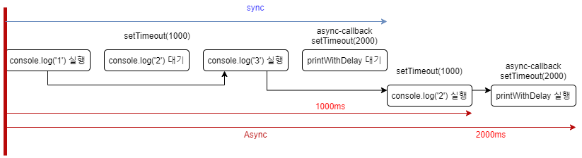

# JAVASCRIPT "studied by 드림코딩"</br>javascript part 4

## 6. Asyncronous 비동기

### 1. Syncronous & Asyncronous

javascript는 동기(Syncronous)적으로 처리가 되는 언어이다. 동기처리란 코드의 요청과 실행이 연속적으로 일어나는 것을 의미한다.


기본적으로 javascript 는 위의 도식과 같이 동기적으로 하나의 소스가 요청한 것의 결과가 나오고 다음 소스를 요청한다. 하지만 javascript 를 비동기적으로 처리하는 메소드들이 있다.

**[SOURCE]**
```javascript
console.log('1');
setTimeout(function(){
    console.log('2');
}, 1000);

console.log('3');
```

**[CONSOLE]**
```
1
3
2
```

위의 소스에서 `setTimeout` 이라는 기능을 통해 `1000`(ms) 의 텀을 두고 실행을 하도록 했다. 그렇기 때문에 `1`, `2`, `3` 순서가 아닌 `1`, `3`, `2` 순서로 출력된 것이다. 이러한 것을 비동기(Asnycronous) 처리 라고 한다. 또한 위의 `setTimeout` 안에서 쓰인 함수는 지정된 시간동안 실행되지 않고 기다렸다가 실행되는데 이러한 함수를 콜백함수(CallBack Function)라고 한다. 하지만 이러한 콜백함수는 비동기에서만 쓰이는 것은 아니다. 동기적으로 사용할 때도 사용을 하는데 아래 내용을 보자.

* **Syncronous callback**

**[SOURCE]**
```javascript
console.log('1');
setTimeout(()=>console.log('hello?'), 1000);
console.log('3');

function printImmediately(print){
    print();
}
printImmediately(()=>console.log('hello?'));
```

**[CONSOLE]**
```
1
3
hello?
2
```
위의 소스에서 콜백함수는 `print` 이다. `print` 라는 콜백함수는 인자를 받기를 기다리고 있다가 `printImmediately` 함수의 실행부에서 애로우 함수를 인자로 전달받고 실행된다. 따라서 동기적으로 `console.log('1')`, `console.log('1')`, `printImmediately()` 가 차례로 실행되고 대기하고 있던 비동기함수 `setTimeout` 이 실행된 것이다.

* **Asyncronous callback**
**[SOURCE]**
```javascript
console.log('1');
setTimeout(function(){
    console.log('2');
}, 1000);

console.log('3');

function printWithDelay(print, timeout) {
    setTimeout(print, timeout);
}

printWithDelay(()=>console.log('async callback'), 2000);
```

**[CONSOLE]**
```
1
3
2
async callback
```
위의 소스는 `printWithDelay` 라고 하는 함수를 콜백함수를 받아서 사용하도록 만들었다. 또한 함수 안에 `setTimeout` 함수를 통해 비동기적으로 사용할수 있도록 만들었다. 위의 소스를 도식화 하면 아래와 같다.



여기서 콜백함수의 특징을 알 수 있다.
1. 콜백함수는 실행하는 타이밍을 사용자가 설정할 수 있다.
2. 콜백함수는 함수를 변수처럼 함수의 인자로 전달할 수 있다.
3. 콜백함수는 동기와 비동기에서 모두 사용된다.

콜백함수는 위와 같이 유용하게 사용할 수 있지만 콜백함수를 연속적으로 남발하면 문제가 발생한다. 아래는 콜백함수를 연속적으로 사용하는 소스이다.

**[SOURCE-js]**
```javascript
class UserStorage{
    loginUser(id, password, onSuccess, onError){
        setTimeout(()=>{
            if(
                (id==='ellie' && password==='dream') ||
                (id==='coder' && password==='academy')
            ){
                onSuccess(id);
            }else{
                onError(new Error('not found'));
            }
        }, 2000);
    }
    getRoles(user, onSuccess, onError){
        setTimeout(()=>{
            if(user==='ellie'){
                onSuccess({name : 'ellie', role : 'admin'});
            } else {
                onError(new Error('no access'))
            }
        }, 1000);
    }
}

const userStorage = new UserStorage();
const id = prompt('enter your id');
const password = prompt('enter your password');
userStorage.loginUser(
    id,
    password,
    user => {
        userStorage.getRoles(
            id,
            userWithRole => {
                alert(`Hello ${userWithRole.name}, your role is ${userWithRole.role}`);
            },
            error => {
                console.log(error);
            }
        );
    },
    error => {
        console.log(error);
    }
)
```

**[SOURCE-html]**
```html
<!DOCTYPE html>
<html>
    <head>
        <script src="test.js" defer></script>
    </head>
    <body></body>
</html>
```

위의 소스는 아래의 역할을 수행하기 위한 소스이다.
1. `UserStorage` 라는 클래스를 선언한다.
2. `UserStorage` 는 `loginUser`, `getRoles` 라는 메소드를 가진다.</br>
 *  2.1. `loginUser` 는 조건문이 `true` 면 `onSuccess`(callback), 그 외는 `onError` 를 실행한다.</br>
 *  2.2. `getRoles` 는 받아온 `user` 가 `ellie` 면 `onSuccess`(callback), 그 외는 `onError`를 실행한다.
3. `userStorage` 라는 변수에 `UserStorage` 라는 클래스를 상속하여 객체를 만든다.
4. `prompt` 로 `id` 와 `password`를 받아온다.
5. `userStorage` 객체의 메소드인 `loginUser` 를 사용한다.
6. `loginUser` 는 `id`, `password`, `user`(callback), `error`(callback) 를 매개변수로 사용한다.
7. `user`(parameter of loginUser) 는 `user`, `userStorage.getRoles`(callback), `error`(callback) 를 매개변수로 사용한다.
8. 받아온 `id` 가 `ellie`, `coder` 일 때 `userWithRole`(callback), 그 외는 `error`(callback) 를 실행한다.

위의 과정에서 볼 수 있듯이 이런식으로 연쇄적으로 callback 을 호출하고 사용하면 이해하기도 힘들 뿐더러(소스가독성 down) 만약에 오류가 발생했을 때 어디서 오류가 발생했는지 확인하기가 어렵다(유지보수 용이성 down). 이러한 이유로 이러한 연쇄 callback 은 잘 사용하지 않고 `async-await`, `promise` 를 많이 쓴다. 이것들에 대해서 알아보자.

### 2. Promise

Promise 는 비동기 처리를 위해 javascript 에서 제공하는 기능이다. 기본적으로 promise 는 어떠한 기능을 성공적으로 처리하면 실행을 하고 성공적으로 실행하지 못하고 오류가 발생하면 error 메세지를 띄워준다. Promise 를 사용할 때는 아래 2가지를 고려해야 한다.
* State
1. operation 이 수행중일 때 : pending
2. operation 이 완전히 수행됨 : fullfield state
3. operation 이 완전히 수행되지 않음 : rejected state
* Producer(서비스 제공자) & Consumer(서비스 사용자)

#### 1. Producer

Producer 는 Promise 를 사용하기 위해 만들어 두는 소스이다. Producer 의 생성방법은 아래와 같다.

```javascript
const promise = new Promise((resolve, reject)=>{
    //doing some heavy work(like network, read files)
});
```

예를 들어보자.
```javascript
const promise = new Promise((resolve, reject)=>{
    setTimeout(()=>{
        resolve('ellie')
    },2000);
    // setTimeout(()=>{
    //   reject(new Error())
    // },1000)
});
```
만약 우리가 정상적으로 값을 받아왔다면 그 값을 resolve를 사용하여 값을 전달하면 된다. 만약 성공적으로 실행되지 못하면 reject 를 사용하면 된다. 위의 예제는 네트워크에서 성공적으로 전달받은 값이 `ellie` 고 받아오는 시간이 2000ms 로 가정한 것이다. 네트워크에서 전달이 실패하면 주석으로 처리한 부분처럼 reject를 사용하면 된다. 위의 소스는 간단하게 resolve 에 대해 알아보기 위함이고 실무에서는 if 문으로 처리를 하면 된다. promise 의 사용을 위한 Producer 설정은 끝났으니 이제 Consumer 에 대해 알아보자.

#### 2. Consumer : then, catch, finally

**1. then**

**[SOURCE]**
```javascript
const promise = new Promise((resolve, reject)=>{
    setTimeout(()=>{
        resolve('ellie')
    },2000);
});

promise.then((value)=>{
    console.log(value);
})
```

**[CONSOLE]**
```
doing something
ellie
```

`promise.then`은 `promise` 가 정상적으로 작동했다면 `then` 내부에 있는 함수를 `value` 라고 하는 인자를 전달받아서 실행한다. 이 `value` 라는 인자는 위에서 `Promise` 를 통해 정상적으로 전달받은 `ellie` 라는 값을 받는다. 만약 위의 `Promise` 의 생성에서 정상적인 값이 전달받지 못한다면 어떻게 될까?

**[SOURCE]**
```javascript
const promise = new Promise((resolve, reject)=>{
    // setTimeout(()=>{
    //     resolve('jeahun')
    // },2000);
    setTimeout(()=>{
        reject(new Error('no network'))
    },1000)
});

promise
.then((value)=>{
    console.log(value);
})
```

위의 소스는 임의로 네트워크 통신에서 에러가 뜬 상황을 가정하여 만든 예제이다. 이러한 경우에 브라우저 환경에서 실행하면 아래와 같은 오류가 뜬다.


이 메시지는 `Uncaught Error` 즉 코드 작성자가 잡지 못한 에러가 존재한다는 메세지인데 이러한 메세지는 프로그램이 작동하지 않을 수도 있다. 만약에 에러가 발생하면 브라우저가 아닌 코드 작성자가 컨트롤 해 주어야 한다. 이는 `catch` 를 통해 해결이 가능하다.

**[SOURCE]**
```javascript
const promise = new Promise((resolve, reject)=>{
    setTimeout(()=>{
        reject(new Error('no network'))
    },1000)
});

promise
.then((value)=>{
    console.log(value);
})
.catch((error)=>{
    console.log(error);
})
```

**[BROWSER]**


위의 결과창에서도 볼 수 있듯이 브라우저에서 에러를 캐치한 것이 아니라 사용자가 캐치했다. 이러한 경우에 에러메시지의 원인을 정확히 알 수 있고 그에 따라 수정도 용이하다. 이러한 에러의 감지를 `catch` 를 통해 이루어 낸다. 이렇게 `Promise` 에 `then`, `catch` 를 연속적으로 사용하는 것을 Promise chaining 이라고 한다.

#### 3. Promise Chaining

위에서 알아보았듯 `Promise` 에서 `then`, `catch` 를 연속적으로 사용하는 것을 Promise Chaning 이라고 한다. 밑의 소스를 보자.

**[SOURCE]**
```javascript
let rlvVar = 1;

const fetchNumber = new Promise((resolve, reject)=>{
    setTimeout(() => resolve(rlvVar), 1000);
})

fetchNumber
.then(num => num*2)
.then(num => num*3)
.then(num => {
    return new Promise((resolve, reject)=>{
        setTimeout(() => resolve(num-1), 1000);
    })
})
.then(num => console.log(num))
```

**[CONSOLE]**
```
5
```

위의 소스에서 볼 수 있듯이 `fetchNumber`에서 정상적으로 전달받은(resolve 를 통해) `rlvVar` 을 인자로 전달 받아 `then` 을 연속적으로 사용할 수 있다. 또한 `then` 은 새로운 `Promise` 를 리턴하고 그 리턴값을 인자로(resolve 를 통해) 받을수도 있다.

#### 4. Promise VS Callback

이제 예전에 작성해 봤던 콜백으로 작성된 코드를 Promise 를 사용하여 고쳐보자.

1. **callback Source**</br>
**[SOURCE-js]**
```javascript
class UserStorage{
    loginUser(id, password, onSuccess, onError){
        setTimeout(()=>{
            if(
                (id==='ellie' && password==='dream') ||
                (id==='coder' && password==='academy')
            ){
                onSuccess(id);
            }else{
                onError(new Error('not found'));
            }
        }, 2000);
    }
    getRoles(user, onSuccess, onError){
        setTimeout(()=>{
            if(user==='ellie'){
                onSuccess({name : 'ellie', role : 'admin'});
            } else {
                onError(new Error('no access'))
            }
        }, 1000);
    }
}

const userStorage = new UserStorage();
const id = prompt('enter your id');
const password = prompt('enter your password');
userStorage.loginUser(
    id,
    password,
    user => {
        userStorage.getRoles(
            id,
            userWithRole => {
                alert(`Hello ${userWithRole.name}, your role is ${userWithRole.role}`);
            },
            error => {
                console.log(error);
            }
        );
    },
    error => {
        console.log(error);
    }
)
```

**[SOURCE-html]**
```html
<!DOCTYPE html>
<html>
    <head>
        <script src="test.js" defer></script>
    </head>
    <body></body>
</html>
```

2. **Promise Source**</br>
html 소스는 callback Source 와 동일하다.

**[SOURCE-js]**
```javascript
class UserStorage{
    loginUser(id, password){
        return new Promise((resolve, reject)=>{
            setTimeout(()=>{
                if(
                    (id==='ellie' && password==='dream') ||
                    (id==='coder' && password==='academy')
                ){
                    resolve(id);
                }else{
                    reject(new Error('not found'));
                }
            }, 2000);
        });
    }
    getRoles(user){
        return new Promise((resolve, reject)=>{
            setTimeout(()=>{
                if(user==='ellie'){
                    resolve({name : 'ellie', role : 'admin'});
                } else {
                    reject(new Error('no access'))
                }
            }, 1000);
        })
    }
}

const userStorage = new UserStorage();
const id = prompt('enter your id');
const password = prompt('enter your password');
userStorage.loginUser(id, password)
.then(user=>userStorage.getRoles(user))
.then(user=>alert(`Hello ${user.name}, your role is ${user.role}`))
.catch(user=>console.log(user))
```

callback source 에 비해 promise source 가 훨씬 간결하고 보기도 편하다. 이러한 이유 때문에 Promise 를 많이 쓰게 될 것이다. 또한 여기서 `then`, `catch` 를 사용할 때 아래와 같이 씀으로써 더욱 소스를 간결하게 만들 수 있다.

```javascript
.then(userStorage.getRoles)
.then(user=>alert(`Hello ${user.name}, your role is ${user.role}`))
.catch(console.log)
```

`then` 에서 받아오는 매개변수(`user`)가 해당 arrow function 에서 바로 쓰일 경우(`userStorage.getRoles(user)`에서의 `user`) 생략하여 사용할 수 있다.

### 3. Async & Await

Async-Await 은 Promise 를 간결하고 깔끔하게 쓸 때 사용한다. 간략한 사용법을 알아보자

```javascript
function fetchUser(){
    // do network request in 10 sec...
    return 'ellie';
}

const user = fetchUser();
console.log(user);

//some soure of UI...
```

위의 소스는 user 의 정보를 가져오는데 10 초가 걸린다고 가정한 소스이다. 이 때 user 의 정보를 가져오는데 10초가 걸리면 그 10초동안 이후의 UI 를 가져오는 소는 실행되지 못한다. 그렇다면 비동기로 한 번 처리해 보자.

**[SOURCE]**
 ```javascript
 function fetchUser(){
     return new Promise((resolve, reject)=>{
         //do newwork request in 10 secs...
         resolve('ellie');
     })
 }
 const user = fetchUser();
 user.then(console.log);
console.log(user);
 //some soure of UI...
 ```

**[BROWSER]**


이런 식으로 사용자의 정보를 받아오는 부분을 비동기적으로 처리를 하게 되면 밑의 UI 를 가져오는 소스가 실행되는 동시에 사용자의 정보는 가져오는 상태가 된다. 이러한 소스에서 `Promise` 를 쓰지 않고 `async` 를 쓰게 되면 소스가 간단해 진다. 아래를 보자.

#### 1. async

**[SOURCE]**
```javascript
async function fetchUser(){
    //do newwork request in 10 secs...
    return `ellie`;
}
const user = fetchUser();
user.then(console.log);
console.log(user);
```

**[BROWSER]**


위의 소스는 함수 앞에 async 를 씀으로써 함수 자체를 Promise 로 만들 수 있다. 이런 식으로 async 를 쓰면 코드를 간결하게 만들 수 있다.

#### 2. await

`await` 문은 `Promise`가 fulfill되거나 reject 될 때까지 `async` 함수의 실행을 일시 정지하고, `Promise`가 fulfill되면 `async` 함수를 일시 정지한 부분부터 실행한다. 이때  `await` 문의 반환값은 `Promise` 에서 fulfill된 값이 된다.

**[SOURCE]**
```javascript
function delay(ms) {
    return new Promise(resolve => setTimeout(resolve, ms))
}

async function getApple() {
    await delay(1000);
    return 'apple'
}

async function getBanana() {
    await delay(1000);
    return 'banana'
}

// async function getBanana(){
//     return delay(1000).then(()=> 'banana')
// }

function pickFruits() {
    return getApple().then(apple=>{
        return getBanana().then(banana=>`${apple} + ${banana}`)
    });
}

pickFruits().then(console.log);
```

`pickFruits` 에서 `Producer` 인 `getApple`, `getBanana` 를 consume 했다. 여기서 Promise Chain 을 사용했는데 이는 콜백지옥에서 봤던 문제가 그대로 발생하는 것을 알 수 있다. Promise chain 을 과도하게 사용하면 콜백함수와 마찬가지로 가독성이 떨어지고 유지보수가 힘들어진다. 이 때 `await`을 사용하면 코드를 간략화 할 수 있다.

**[SOURCE]**
```javascript
function delay(ms) {
    return new Promise(resolve => setTimeout(resolve, ms))
}

async function getApple() {
    await delay(1000);
    return 'apple'
}

async function getBanana() {
    await delay(1000);
    return 'banana'
}

async function pickFruits() {
    const apple = await getApple();
    const banana = await getBanana();
    return `${apple} + ${banana}`
}

pickFruits().then(console.log);
```

async-await 을 사용하면 기존의 Promise 를 쓰는 것보다 가독성이 좋아진다. 또한 우리가 사용하는 문법과 유사한 형태로 작성이 되기 때문에 더욱 편하게 코드 작성이 가능하다.</br>
async-await 역시 오류처리를 할 수 있는데 위의 async function pickFruits() 함수만 수정해보자.

```javascript
async function pickFruits() {
    try {
        const apple = await getApple();
        const banana = await getBanana();
        return `${apple} + ${banana}`
    } catch (error) {
      console.log(error);
    }
}
```

이런식으로 기존의 js 에서 사용하던 try-catch로 오류를 잡아낼 수 있다. 하지만 이렇게 async-await 이 유용하고 좋아보이지만 주의 해야 할 사항이 있다. 아래를 보자.

**[SOURCE]**
```javascript
function delay(ms) {
    return new Promise(resolve => setTimeout(resolve, ms))
}

async function getApple() {
    await delay(1000);
    return 'apple'
}

async function getBanana() {
    await delay(1000);
    return 'banana'
}

async function pickFruits() {
    try {
        const apple = await getApple();
        const banana = await getBanana();
        return `${apple} + ${banana}`
    } catch (error) {
        console.log(error);
    }
}

pickFruits().then(console.log);
```

이 소스에서 await 2개를 사용하면 getApple() 이 실행되는 1초이후에 getBanana() 가 1초동안 실행되어서 총 2초가 소요된다. 하지만 2개의 함수는 독립적이므로 이런 식으로 사용하면 낭비이다. 이를 해결하려면 아래와 같이 작성하면 된다.
**[SOURCE_1]**
```javascript
async function pickFruits() {
  try {
    const apple = await getApple();
    const banana = await getBanana();
    return `${apple} + ${banana}`
  } catch (error) {
    console.log(error);
  }
}
```
**[SOURCE_2]**
```javascript
async function pickFruits() {
    try {
        const applePromise = getApple();
        const bananaPromise = getBanana();
        const apple = await applePromise;
        const banana = await bananaPromise;
        return `${apple} + ${banana}`
    } catch (error) {
        console.log(error);
    }
}
```

위의 SOURCE_1 은 async 한 pickFruits 함수에서 단일한 promise 안에 2개의 await 이 존재한다. 따라서 getApple 프로미스가 끝나고 getBanana 프로미스가 실행된다. 하지만 밑의 SOURCE_2 는 다른 변수에 프로미스를 저장하면 Promise 안의 코드블록이 바로 실행되므로 2개의 프로미스를 병렬로 실행하는 것이 된다. 따라서 1초가 소모된 후 await 을 걸어도 applePromise 의 리턴값만 전달해 주므로 시간낭비가 없다. 이러한 기능을 편하게 만들어주는 Promise 의 API 가 존재하는데 이에 대해 알아보자.

#### 3. Promise APIs --> 나중에 복습할 때 다시 해 보기
