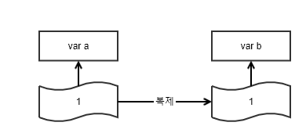
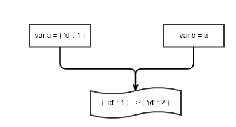
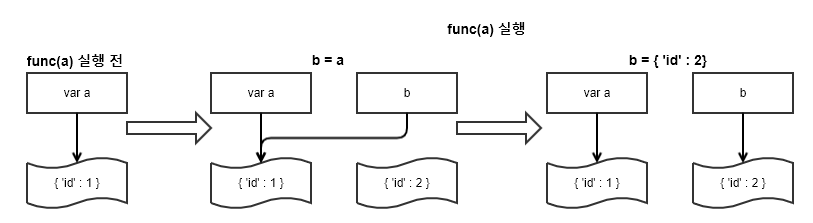
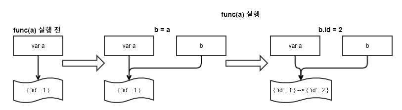

# <center>JAVASCRIPT "studied by 생활코딩"</br>javascript part 3</center>


## 1.객체<span style="font-size : 18px"> Object</span>
### 1. 객체 기초
객체 안의 변수를 프로퍼티(property), 함수를 메소드(method) 라고 부른다.
밑의 코드에서 확인해 보자.

<span style = "font-size:small">**[SOURCE]**</span>
```javascript
var person = {}
person.name='egoing'
person.introduce=function () {
    return 'My name is '+this.name;
}
console.log(person.introduce());
```

<span style = "font-size:small">**[CONSOLE]**</span>
```
My name is egoing
```

위의 코드에서 `person{}` 이라는 객체 안에 `name`이라는 객체 안의 변수인 **property**가 있고 또한 `introduce()`라고 하는 함수인 **method**가 선언되어 있다.

2. 객체를 만드는 과정에서 1. 에서 살펴본 방법은 소스가 분산되어 있다
이러한 문제를 해결하려면 밑의 코드를 참조하라

<span style = "font-size:small">**[SOURCE]**</span>
```javascript
var person={
  'name': 'egoing',
  'introduce': function(){
    return 'My name is '+this.name;
  }
}
console.log(person.introduce());
```

<span style = "font-size:small">**[CONSOLE]**</span>
```
My name is egoing
```

### 2. 생성자와 new

#### 1. 생성자

<span style = "font-size:small">**[SOURCE]**</span>
```javascript
function person(){}
var p1=person()
var p2=new person()
console.log(p1+'\n'+p2);
```

<span style = "font-size:small">**[CONSOLE]**</span>
```
undefined
person {}
```

위의 코드에서 `p1` 변수에 함수를 저장하면 현재 `person()` 이라는 함수에 리턴값이 없으므로 `undefined` 가 출력된다.
하지만 밑의 `new` 기능을 사용하여 `p2` 변수에 저장하면 `person{}` 이라고 하는 객체를 만들고 이를 `p2`에 저장하는 것이다.
이러한 `javascript`에서의 기능을 생성자라고 한다.

<span style = "font-size:small">**[SOURCE]**</span>
```javascript
var person1 = {
  'name':'egoing',
  introduce:function () {
    return 'My name is '+this.name;
  }
}
var person2 = {
  'name':'liali',
  introduce:function () {
    return 'My name is '+this.name;
  }
}
console.log(person1);
console.log(person2);
```

<span style = "font-size:small">**[CONSOLE]**</span>
```
{ name: 'egoing', introduce: [Function: introduce] }
{ name: 'liali', introduce: [Function: introduce] }
```

위의 코드에서 여러사람의 정보를 각각의 객체로 생성할 경우 `introduce : function(){}` 부분은 정확히 같은 소스임에도 지속적으로 반복하여야 한다.
이러한 문제는 생성자와 `new`로 해결이 가능하다.
밑의 소스를 참고하라

<span style = "font-size:small">**[SOURCE]**</span>
```javascript
function Person(name) {
  this.name=name;
  this.introduce=function () {
    return 'My name is '+this.name;
  }
}

var p1 = new Person('egoing')
var p2 = new Person('liali')
console.log(p1);
console.log(p2);
```

<span style = "font-size:small">**[CONSOLE]**</span>
```
{ name: 'egoing', introduce: [Function: introduce] }
{ name: 'liali', introduce: [Function: introduce] }
```

이 소스에서 볼 수 있듯 바로 위의 위 코드와는 다르게 `introduce : function(){}` 부분의 코드가 간소화 되었다.
이와 같이 생성자 함수는 객체의 초기화의 기능을 하는 것이다.
이를 통해 코드의 재사용성이 대폭 상승한다.

### 2. 전역객체<span style="font-size : 16px"> Global Object</span>

기본적으로 전역객체는 javascript 가 가지고 있는 기본 객체이다.
전역범위에 접근하기 위해 사용되며 브라우저와 node.js 에서의 환경이 조금씩 다르다.
전역객체의 사용과 환경마다 다르게 적용되는 점을 밑에서 정리하겠다.

#### 1. 브라우저 환경

<span style = "font-size:small">**[SOURCE]**</span>
```html
<!DOCTYPE html>
<html>
    <head></head>
    <body>
        <script>
            var o = {'func':function(){
            document.write('hello?');
            }}
            o.func();
            window.o.func();
        </script>
    </body>
</html>
```

<span style = "font-size:small">**[BROWSER]**</span>

</img>

#### 2. Node.js 환경


<span style = "font-size:small">**[SOURCE]**</span>
```javascript
var o = {
  func:function(){
    console.log('hello?');
  }
}
o.func();
global.o.func();
```

<span style = "font-size:small">**[CONSOLE]**</span>
```
hello?
hello?
```

기본적으로 browser 환경에서 전역객체는 `window` 를 사용한다.
하지만 Node.js환경에서는 `global`이 전역객체이다. 또한 Node.js 에서는 file.js 파일 자체를 node file.js 로 실행 할 때 `global`은 전역객체로 취급을 하지 않는다. Node.js 는 기본적으로 파일 자체를 모듈로 취급하기 때문인데 이는 나중에 Node.js 공부할 때 정리하겠다
### 3. this

#### 1. 함수와 this

<span style = "font-size:small">**[SOURCE]**</span>
```javascript
function func() {
  if(global===this){
    console.log("global===this");
  }
}

func();
```

<span style = "font-size:small">**[CONSOLE]**</span>
```
global===this
```
위의 소스에서 알 수 있듯이 `func()` 라는 함수 안에서 `this` 와 전역객체인 `global` 과 같음을 알 수 있다.

#### 2. 메소드와 this

<span style = "font-size:small">**[SOURCE]**</span>
```javascript
var o = {
  func : function(){
    if(o===this){
      console.log("o===this");
    }
  }
}
o.func();
```

<span style = "font-size:small">**[CONSOLE]**</span>
```
o===this
```
사실 이 결과는 위의 **함수와 this**의 소스와 같은 것을 보여준다.
**함수와 this** 에서의 `func()` 의 `this` 는 브라우저에서의 `window`, nodejs에서의 `global`을 의미한다.
**2. 메소드와 this** 에서의 소스는 `o`라는 객체에 `func`라는 메소드에서의 `this`는 바로 위의 객체인 `o` 를 의미한다.

#### 3. 생성자와 this

<span style = "font-size:small">**[SOURCE]**</span>
```javascript

var funcThis = null;

function Func() {
    funcThis=this;
}
var o1=Func();
if(funcThis===global){
    console.log('global');
}

var o2=new Func();
if(funcThis===o2){
    console.log('o2');
}
```

<span style = "font-size:small">**[CONSOLE]**</span>

```
global
o2
```

`var o1=Func()` 에서는 `Func()` 라는 함수를 실행 한 후 리턴값을 `o1` 에 저장한다.(이 때 리턴 값이 없으므로 `o1` 은 `undefined`가 뜰 것이다.)
`Func()` 라는 함수가 실행 되면 `funcThis`라는 변수에 `this`가 들어가는데 이 때 `this`는 `Func()` 라는 함수가 선언 될 때 전역이기 때문에 `global` 이 들어간다. 따라서 그 밑의 if문은 참이며 ``console.log()`` 가 실행된다.
밑의 `var o2=new Func()` 는 `Func()`라는 함수를 생성자 함수로 만들었다. 이렇게 되면 기본적으로 `Func{}` 라는 객체가 만들어 지고 이를 `o2`에 저장하는 것이다. 이에 따라 `Func()` 라는 함수를 실행하면 `this` 는 `Func{}` 라는 객체를 포함하는 객체인 `o2`를 가리킨다. 이에 따라 바로 밑의 if문은 참이며 `console.log()` 가 실행된다.

#### 4. apply와 this

<span style = "font-size:small">**[SOURCE]**</span>
```javascript
var o={}
var p={}

function func() {
    switch (this) {
        case o:
            console.log('o');
            break;

        case p:
            console.log('p');
            break;
        case global:
            console.log('global');
            break;
    }
}

func()
func.apply(o);
func.apply(p);
```

<span style = "font-size:small">**[CONSOLE]**</span>

```
global
o
p
```

여기서 `func()` 를 했을 때의 `func()`는 전역객체인 `global`의 메소드가 된다.
`func.apply(o)` 를 했을 때의 `func()`는 `o`의 메소드가 되며 `func.apply(p)` 를 했을 때의 `func()`는 `p` 의 메소드가 된다. 이해를 돕기 위해 밑의 그림을 참조하라.

</img>

### 4. 상속 <span style="font-size : 12px"> inheritance</span>

javascript 에서의 상속은 상위 객체의 로직을 이어 받되 자신의 기능을 수정하고 변경하여 새로운 객체를 만들 수 있도록 도와준다.

#### 1. 상속의 기본 사용법

<span style = "font-size:small">**[SOURCE]**</span>
```javascript
function Person(name) {
    this.name=name;
}

Person.prototype.name=null;
Person.prototype.introduce=function () {
    return 'My name is '+this.name;
}

function Programmer(name) {
    this.name=name;
}
Programmer.prototype=new Person();

var p1=new Programmer('egoing')
console.log(p1.introduce());
```

<span style = "font-size:small">**[CONSOLE]**</span>

```
My name is egoing
```

위의 `Person()` 이라는 함수 정의 밑에 `Person()` 이라는 객체(기본적으로 javascript에서의 함수는 객체로 취급한다.)에 `name`이라는 프로퍼티를 선언하면서 동시에 `introduce()` 라고 하는 메소드를 선언하였다.

```javascript
Programmer.prototype=new Person();
```

이 부분에서 `Programmer`의 `prototpye`이라는 프로퍼티에 `Person`이라고 하는 객체를 할당하였다. 이러한 할당을 상속이라고 하며 `Programmer`라고 하는 객체에 `Person`이라고 하는 객체를 상속시킨 것이다. 이에 따라 `p1.introduce()`를 하면 `p1` 이라는 변수 안에 `Programmer`라는 객체가 존재하고 `Programmer`라는 객체 안에 `Person` 이라는 객체가 존재하며 `Person` 이라고 하는 객체 안에 `introduce()` 라고 하는 메소드가 존재하므로 `p1.introduce()`는 `My name is egoing` 이라는 결과 값이 나온다.

여기서 당장 이해하기는 힘들다. `prototype` 이라는 프로퍼티에 대해서도 배우지 않았기에 추후에 이러한 프로퍼티들을 공부한 후 제대로 이해하자. 이 부분에서 중요한 것은 부모객체인 `A` 객체에 자식객체인 `B` 객체를 상속시키기 위해서는 `B.prototpye=new A` 같은 형태를 사용해야 함만을 기억하자.


#### 2. 상속하는 객체의 기능추가(자식객체의 기능추가)

바로 위의 상속의 기본 사용에서의 예제는 상속을 굳이 쓸 이유가 없다. 상속은 자식객체가 부모객체의 로직은 그대로 가지고 있되 기능을 추가하거나 수정하여 쓰는 것이 상속의 장점이다. 밑의 예제를 통해 이를 확인해 보자

<span style = "font-size:small">**[SOURCE]**</span>
```javascript
function Person(name) {
    this.name=name;
}

Person.prototype.name=null;
Person.prototype.introduce=function () {
    return 'My name is '+this.name;
}

function Programmer(name) {
    this.name=name;
}
Programmer.prototype=new Person();
Programmer.prototype.coding=function () {
    return "hello world"
}

function Designer(name) {
    this.name=name;
}
Designer.prototype=new Person();
Designer.prototype.design=function () {
    return "beautiful!"
}

var p1=new Programmer('egoing');
console.log(p1.introduce());
console.log(p1.coding());

var p2=new Designer('leeche');
console.log(p2.introduce());
console.log(p2.design());
```

<span style = "font-size:small">**[CONSOLE]**</span>

```
My name is egoing
hello world
My name is leezche
beautiful!
```

위의 소스는 `Person` 이라는 부모객체에 `Programmer`, `Designer` 라는 자식객체를 상속시킨다.
`Person` 객체의 기본 기능은 `My name is + this.name` 이라는 문장을 console 에 출력시키는 기능이다. 자식객체인 `Programmer`와 `Designer` 역시 이러한 기능을 가지고 있지만 이 2개의 자식객체는 그 기능에 더해 `hello world` 를 출력하는 `coding`이라는 메소드, `beautiful` 을 출력하는 `design` 메소드를 추가로 가지고 있다. 이것이 상속에서 자식객체가 부모객체의 로직이나 기능은 유지하되 자신의 기능을 추가한 부분이다.

</img>

여기서 만약 부모객체의 정보를 바꾼다면 어떻게 될까?

```javascript
Person.prototype.name=null;
Person.prototype.introduce=function () {
    return 'My name is '+this.name;
}
```

위의 이 소스를 밑의 소스로 바꾸면

```javascript
Person.prototype.name=null;
Person.prototype.introduce=function () {
    return 'My nickname is '+this.name;
}
```

밑의 결과값이 나온다.

<span style = "font-size:small">**[CONSOLE]**</span>

```
My nickname is egoing
hello world
My nickname is leezche
beautiful!
```

위의 결과와 같이 부모객체만 바꾸면 자식객체 역시 출력이 동시에 바뀐다. 이러한 점이 상속의 장점으로 볼 수 있다.

이제까지 상속에 대한 개념과 그 장점에 대해 알아보았다. 하지만 우리는 상속에 쓰이는 `prototpye` 이라는 프로퍼티에 대해 잘 알지 못한다. 밑에서 이제 그 `prototpye` 이라는 프로퍼티에 대해 알아보자.

### 5. 프로토타입<span style = "font-size : medium"> prototype</span>

<span style = "font-size:small">**[SOURCE]**</span>

```javascript
function Ultra() {}
Ultra.prototype.ultraProp = true;

function Super() {}
Super.prototype = new Ultra();

function Sub() {}
Sub.prototype = new Super();

var o = new Sub();
console.log(o.ultraProp);
```

<span style = "font-size:small">**[CONSOLE]**</span>

```
true
```

`new` 라고 하는 속성에 대해 복기해 보자. `var 변수 = new 함수();` 이런식으로 `new` 를 쓰게 되는데 기본적으로 함수를 객체로 return 하여 변수에 저장한다고 이해했다. 하지만 그런 기능만을 가지고 있다면 `var 변수 = 객체;` 이런식으로 선언하면 되는데 굳이 `new` 를 쓰는 이유가 뭘까? 이는 `new 함수` 부분의 함수가 가지고 있는 프로퍼티나 메소드를 쓰고 싶기에 이렇게 쓰는 것이다.
이제 프로토타입에 대해서 알아보자. 프로토타입은 기본적으로 javascript 에서 객체를 상속하고 싶을 때 사용한다. 위의 소스에서 `o` 라는 변수에 `Sub()` 라는 함수를 생성자 함수로서 객체로 저장하였다. 또한 `Sub`의 `prototpye`에 `Super`를 생성자함수로서 객체로 저장하고 `Super`의 `prototpye`에 `Ultra`를 생성자함수로서 객체로 저장하였다. 또한 `Ultra` 라는 객체의 `prototpye`의 프로퍼티로 `ultraProp`에 `true`를 저장하였다. 이러한 과정을 통해 `o.ultraProp` 을 호출하면 `o`라고 객체를 포함하는 변수에 `ultraProp` 이라는 프로퍼티가 직접적으로 존재하지 않아도 호출할 수 있게 된다. 이렇게 상속을 연속적으로 `prototpye` 을 통해 발생시켜 접근할 수 있도록 하는 것을 **prototpye chain** 이라고 한다. 밑의 그림을 참고하라.

</img>


### 6. 표준 내장 객체<span style = "font-size : medium"> Standard Built in Object</span>

표준 내장 객체란 javascript 가 기본적으로 제공하는 객체를 말한다. 우리가 정의하고 만들어낸 객체는 사용자 정의 객체라 하며 표준 내장 객체와 사용자 정의 객체를 적절히 섞어서 사용할 수도 있다.

#### 1. 표준내장객체의 기본적인 사용법

javascript 는 기본적으로 아래와 같은 내장 객체를 가지고 있다

* Object
* Function
* Array
* String
* Boolean
* Number
* Math
* Date
* RegExp

위의 내장객체에 대한 자세한 사용법은 추가공부에서 천천히 공부한다. 밑에서는 표준내장객체의 기본적인 사용법과 사용자가 수정하고 기능을 추가하는 사용자 정의 객체에 대해서 알아보자


<span style = "font-size:small">**[SOURCE]**</span>

```javascript
var arr = new Array('Seoul', 'NewYork', 'Ladarkh', 'Busan', 'Tsukuba')

function getRandomValueFromArray(arr) {
    var index = Math.floor(arr.length*Math.random());
    return arr[index];
}
console.log(getRandomValueFromArray(arr));
```

<span style = "font-size:small">**[CONSOLE]**</span>

```
Tsukuba
//값은 랜덤으로 도출됨!
```

위의 소스는 Math, Array 등을 사용하였다. 이러한 표준내장객체 역시 **객체** 이므로 기본적으로 우리가 사용하던 객체의 형식과 문법에 맞게 사용하면 된다.

#### 2. 사용자 정의 객체의 선언과 사용법

사용자정의객체는 표준내장객체를 수정하거나 기능을 추가하여 만들 수 있다. 밑의 소스를 보자.

<span style = "font-size:small">**[SOURCE]**</span>

```javascript
Array.prototype.random = function () {
    var index = Math.floor(this.length*Math.random());
    return this[index];
}
var capitalCityArr = new Array('Seoul', 'NewYork', 'Ladarkh', 'Busan', 'Tsukuba')
console.log(capitalCityArr.random());
```

<span style = "font-size:small">**[CONSOLE]**</span>

```
NewYork
//값은 랜덤으로 도출됨!
```

위의 소스를 해석해 보자.
`Array` 라고 하는 표준내장객체의 `prototpye`에 `random()` 이라는 메소드를 선언하고 정의 하였다. 이 때 this는 이 메소드가 사용될 객체 자체를 가르키게 된다. 그렇다면 밑의 `new Array` 를 통해 만들어진 객체인 `capitalCityArr` 를 `random()` 메소드 안의 `this`가 가르키게 되는 것이다. 이렇듯 `Array.random();` 이라는 메소드는 기본적으로 존재하는 메소드가 아니고 우리가 정의하여 사용할 수 있게 되었다. 이러한 기능을 **사용자정의객체** 라고 한다. 이러한 방식으로 코드를 작성한다면 우리는 `random()` 이라고 하는 메소드가 배열과 관련된 객체인 `Array` 의 상속으로 처리되었기에 `random()` 메소드는 배열과 관련되어 있음을 간접적으로 알 수 있다.

#### 3. 표준내장객체-Object

Object 객체는 표준내장객체 중 하나로 기본적으로 아무것도 상속받지 않은 상태의 객체를 말한다. 또한 javascript 의 모든 객체는 기본적으로 Object 객체를 상속받는다. 이러한 이유로 javascript에서 사용자가 정의한 객체 역시 Object 표준내장객체를 상속받으며 이에 따라 Object 표준내장객체의 프로퍼티와 메소드를 사용할 수 있다.

##### Object.method, Object.prototpye.method

<span style = "font-size:small">**[SOURCE]**</span>

```javascript
var o = {'name':'eoing', 'age':'20', 'city':'Seoul'}
console.log('Object.keys(o) : ',Object.keys(o));

var o = new Array(1, "apple", "???");
console.log('o.toString() : ',o.toString());
```

<span style = "font-size:small">**[CONSOLE]**</span>

```
Object.keys(o) :  [ 'name', 'age', 'city' ]
o.toString() :  1,apple,???
```

우리가 여기서 알아야 할 것은 keys()나 toString()이라는 메소드가 아니다. 우리는 Object.method와 Object.prototpye.method의 차이점을 알고 싶은 것이다.

위의 소스에서 Object.keys(var)는 아래의 소스와 동일하다.
```javascript
Object.keys=function(){}
```
또한 object.prototpye.toString()은 아래의 소스와 동일하다.
```javascript
object.prototype.toString=function(){}
```

`Object.method` 는 `Object`라는 표준내장객체 자체의 메소드 이므로 기본적으로 `Object.keys(변수)` 같은 형태로 사용한다. 하지만 `object.prototpye.method`와 같은 형태는 `object`라는 객체에서 모두 사용이 가능하다. 즉 `object`가 아닌 다른 변수 `o`, `listjeahun` 같은 사용자가 정의한 객체에서도 사용이 가능하다.
`Object` 라고 하는 내장객체는 모든 객체의 부모객체이다. 그렇기 때문에 `Object.prototpye.method` 의 `method` 는 사용자가 정의한 객체건 표준내장객체건 **javascript 에서 사용하는 모든 객체에서 사용이 가능하다**. 이를 바꿔 말하면 `Object.prototpye.변수` 에 우리가 원하는 메소드를 삽입하면 마찬가지로 javascript에서 사용하는 모든 객체에서 접근이 가능하다.


#### 4. 모든 객체에서 사용할 수 있는 method 정의

위에서 Object.prototpye.method 는 javascript의 모든 객체에서 사용할 수 있음을 알게되었다. 이제 그 method 의 정의와 사용에 대해서 알아보자.

<span style = "font-size:small">**[SOURCE]**</span>

```javascript
Object.prototype.contain=function (needle) {
    for(var name in this){
        if(this[name]===needle){
            return true;
        }
        return false;
    }
}

var obj = {'name' : 'jeahun', 'nickName' : 'LiaLi', 'age' : '24'}
console.log(obj.contain('name'));
var arr = ['jeahun', 'LiaLi', '24']
console.log(arr.contain('jeahun'));
```

<span style = "font-size:small">**[CONSOLE]**</span>

```
false
true
```

위의 소스는 javascript 의 모든 객체에서 사용할 수 있는 어떠한 객체 안의 element 들 중에 인자로 받는 문자열이 존재하는 지를 판별하는 method를 만들었다. 하지만 이러한 방식은 큰 단점을 가지고 있는데 이는 밑에서 알아보겠다.

#### 5. Object 확장의 위험성

이제 위의 소스에서 obj 라고 하는 객체와 arr 라고 하는 배열의 요소를 출력하기 위해 for in 문을 사용하여 보자.

<span style = "font-size:small">**[SOURCE]**</span>

```javascript
Object.prototype.contain=function (needle) {
    for(var name in this){
        if(this[name]===needle){
            return true;
        }
        return false;
    }
}

var obj =
{'name' : 'jeahun', 'nickName' : 'LiaLi', 'age' : '24'}
obj.contain('name');
var arr =
['jeahun', 'LiaLi', '24']
arr.contain('jeahun');

for(var name in obj){
    console.log(name);
}
for(var name in arr){
    console.log(name);
}
```

<span style = "font-size:small">**[CONSOLE]**</span>

```
name
nickName
age
contain
0
1
2
contain
```

결과 값은 우리가 원하는 값이 아니라 contain 을 포함하고 있다. 이러한 문제는 Object.prototpye.contain을 for in 문에서 출력하고 있기에 생성되었다. 물론 이러한 문제를 해결하는 방법이 있기는 하지만 굳이 이러한 번거로움을 감수할 필요는 없다. 해결방법은 밑에서 제시하겠다.

```javascript
for(var name in obj){
    console.log(name);
}
```

```javascript
for(var name in obj){
    if(o.hasOwnProperty(name)){
      console.log(name);
    }
}
```
`hasOwnProperty(인자)` 메소드는 인자로 받은 변수가 자신 즉 위의 소스에서는 `obj` 의 프로퍼티로 가지고 있는지를 확인하고 가지고 있다면 `True` 를 가지고 있지 않다면 `False` 를 출력하는 메소드이다. 만약에 객체의 확장을 반드시 사용해야 한다면 쓸 수는 있지만 다시 한 번 말하지만 이러한 번거로움을 감수할 필요는 없다.

## 2. 원시 데이터 타입<span style="font-size : 18px"> primitive type</span>
javascript에서의 데이터 타입은 크게 2가지로 구분할 수 있다. 객체와 객체가 아닌것으로 구분을 한다. 객체가 아닌 데이터 타입은 아래와 같다.

* 숫자
* 문자열
* 불리언(true/false)
* null
* undefined

객체가 아닌 데이터 타입을 원시 데이터 타입(primitive type) 이라고 한다.

<span style = "font-size:small">**[SOURCE]**</span>

```javascript
var str = 'coding'
console.log(str.length);
console.log(str.charAt(0));
```

<span style = "font-size:small">**[CONSOLE]**</span>

```
6
c
```

위에서 문자열은 객체가 아닌 원시데이터 타입이라고 했다. 하지만 바로 위의 소스에서는 문자열을 마치 객체처럼 사용하여 메소드와 프로퍼티를 사용하였다. 이렇게 되면 str 이라고 하는 문자열은 객체로 취급되는 것처럼 보인다. 하지만 이는 일시적으로 사용하는 것으므로 메소드나 프로퍼티가 사용될 때 임시로 사용되고 그 객체는 버려진다.

```javascript
var str = 'coding'
//str = new String('coding');
console.log(str.length);
console.log(str.charAt(0));
```

위의 소스에서 주석에서 처럼 임시적으로 객체를 만들어주고 해당 메소드나 프로퍼티의 사용이 종료되면 기본적으로 그 객체는 사라진다. 이는 밑의 소스를 참고하면 자명해진다.

<span style = "font-size:small">**[SOURCE]**</span>

```javascript
var str = 'coding'
str.prop='everybody'
console.log(str.prop);
```

<span style = "font-size:small">**[CONSOLE]**</span>

```
undefined
```

`str` 이라는 문자열이 만약 지속적으로 객체로 취급된다면 `str.prop` 은 정상적으로 출력이 되어야 하나 결과값을 보면 `undefined` 가 뜨게 된다. 이는 위의 이유와 같다.
이렇게 원시 데이터 타입들을 일시적으로 javascript 에서 제공하는 메소드와 프로퍼티를 사용하기 위해 임시적으로 그 원시 데이터 타입을 객체화 시켜 주는 것을 **Wrapper Object** 라고 한다. 주의 할 것은 javascript 는 이러한 Wrapper Object 를 자동으로 지원하지만 다른 언어들의 동작은 다를 수 있으므로 조심하자. 밑은 각 원시데이터 타입으로 만들어지는 Wrapper Object 이다.

|원시 데이터 타입|Wrapper Object|
|------|------|
|숫자|Number|
|문자열|String|
|불리안(true/false)|Boolean|
|null|없음|
|undefined|없음|

## 3. 복제

### 1. 복제

<span style = "font-size:small">**[SOURCE]**</span>

```javascript
var a=1;
var b=a;
b=2;
console.log(a);
```

<span style = "font-size:small">**[CONSOLE]**</span>

```
1
```

위의 소스를 그림으로 나타내면 아래와 같다



위는 당연한 것처럼 보인다. 하지만 밑의 소스를 보면 이는 꽤 복잡한 문제임을 알 수 있다.

### 2. 참조

<span style = "font-size:small">**[SOURCE]**</span>

```javascript
var a={'id':1};
var b=a;
b.id=2;
console.log(a.id);
```

<span style = "font-size:small">**[CONSOLE]**</span>

```
2
```

복제 부분에서 알아보았던 소스와 달리 위의 소스는 `b.id` 의 값 만을 건드렸음에도 `a.id` 의 값이 변화하였다. 이는 원시데이터타입과는 달리 객체는 다르게 동작하기 때문이다. 아래의 그림을 참조하라.



왜 이런일이 발생하는 것일까? 이는 원시데이터타입과 객체가 저장하는 정보가 다르기 때문이다. 원시데이터타입은 기본적으로 실제 값을 가지고 있다. 하지만 객체가 변수에게 전달하는 정보는 실제 값이 아닌 참조의 방법이기 때문이다.

정리하자면 javascript 에서의 **변수는 원시데이터타입을 저장할 경우에는 그 원시데이터의 값 자체를 저장하지만, 변수에 객체를 저장한다면 변수는 객체의 주소를 저장하고 있는 것이다.**

<span style = "font-size:small">**[SOURCE]**</span>

```javascript
var a={'id':1};
var b=a;
b.id=2;
console.log(a.id);
```

<span style = "font-size:small">**[CONSOLE]**</span>

```
1
```

### 3. 함수에서의 참조와 복제

위에서 살펴본 내용은 함수에서의 동작에서도 마찬가지로 작동한다. 이 함수에서의 참조와 복제에 대해 알아보자

<span style = "font-size:small">**[SOURCE]**</span>

```javascript
var a = 1;
function func(b) {
    b=2;
}
func(a);
console.log(a);
```

<span style = "font-size:small">**[CONSOLE]**</span>

```
1
```

위의 소스는 `a`를 선언하고 함수 `b` 의 인자로 `a` 를 사용하여 `a` 값을 바꾸었다. 이 때 결과값은 자명하게 `1`이 나온다.

<span style = "font-size:small">**[SOURCE]**</span>

```javascript
var a = {'id':1};
function func(b) {
    b = {'id':2};
}
func(a);
console.log(a);
```

<span style = "font-size:small">**[CONSOLE]**</span>

```
{ id: 1 }
```

위 소스는 위의 위 소스에서처럼 동작한다고 생각하여 결과값을 예측하면 `{id: 2}` 가 나와야 하나 결과값은 `a`가 선언될 때 할당되었던 `{id: 1}` 이 나온다. 이러한 결과는 위에서 살펴보았던 변수에 객체가 할당될 때의 문제와 같다.
`func(a)`가 실행된다면 아래의 소스와 같은 과정을 거치게 된다.

```javascript
b = a;
b = {'id':2};
```

이 부분의 소스를 도식화 하면 아래와 같다.



`b = a` 가 실행되면 `a` 는 `{ 'id' : 1 }` 객체를 가리키고 있고 `b` 에 `a` 를 대입했기 때문에 `a` 가 가지고 있는 참조인 `{ 'id' : 1 }` 객체를 똑같이 가리키게 된다. 하지만 `b = { 'id' : 2 }` 가 실행되면 `a` 는 여전히 `{ 'id' : 1 }` 객체를 가리키지만 `b` 는 `{ 'id' : 2 }` 객체를 가리키게 된다. 따라서 최종 `a` 의 값은 `{ 'id' : 1 }` 인 것이다. 그렇다면 정상적으로 a 의 값을 바꾸려면 어떻게 해야 할까? 아래의 소스를 참조하라.

```javascript
var a={'id':1};
function func(b) {
    b.id=2;
}

func(a);
console.log(a.id);
```

<span style = "font-size:small">**[CONSOLE]**</span>

```
2
```

이 소스를 도식화 하면 아래와 같다.



`b = a` 가 실행되면 `a` 와 `b` 모두 `{ 'id' : 1 }` 객체를 가리킨다. `b.id = 2` 가 실행될 때 `a` 와 `b` 모두 `{ 'id' : 1 }` 객체를 가리키고 있으므로 `{ 'id' : 1 }` 에서 `{ 'id' : 2 }` 로 수정이 된다.
